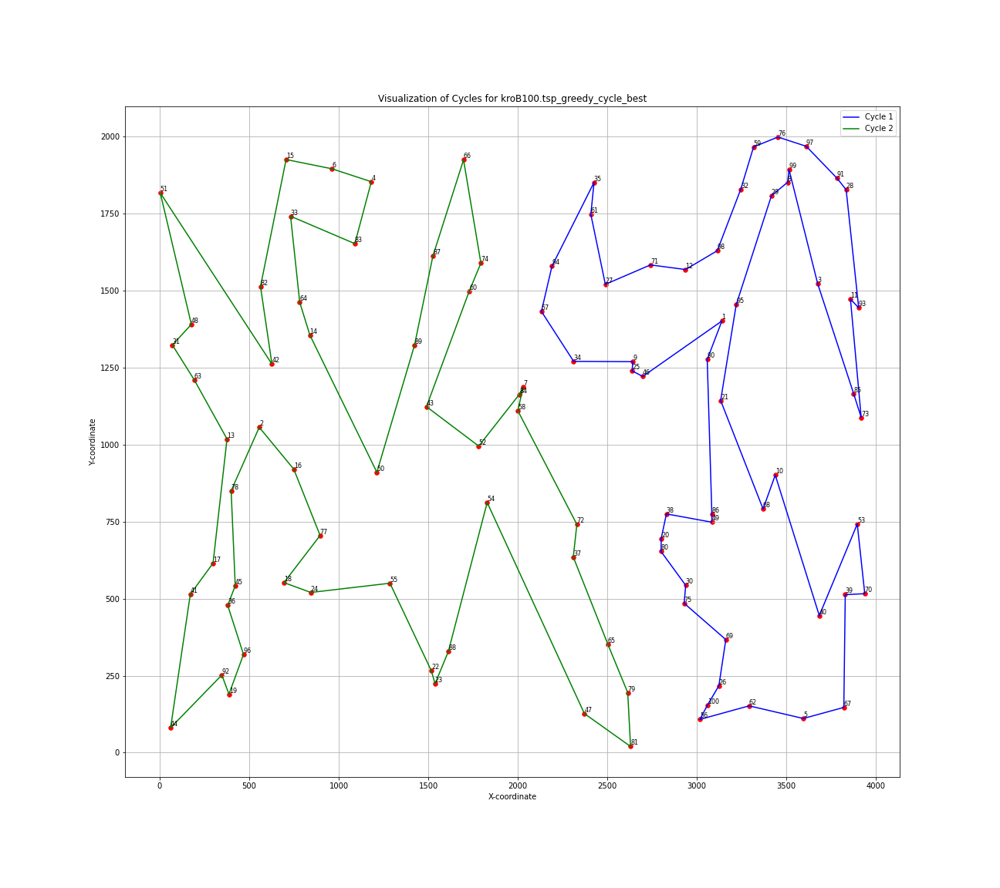
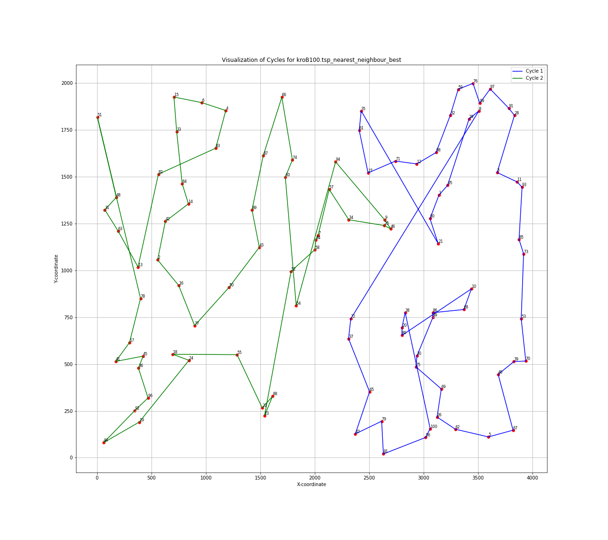
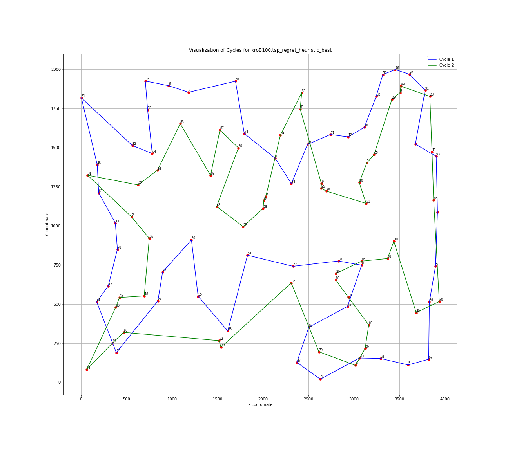
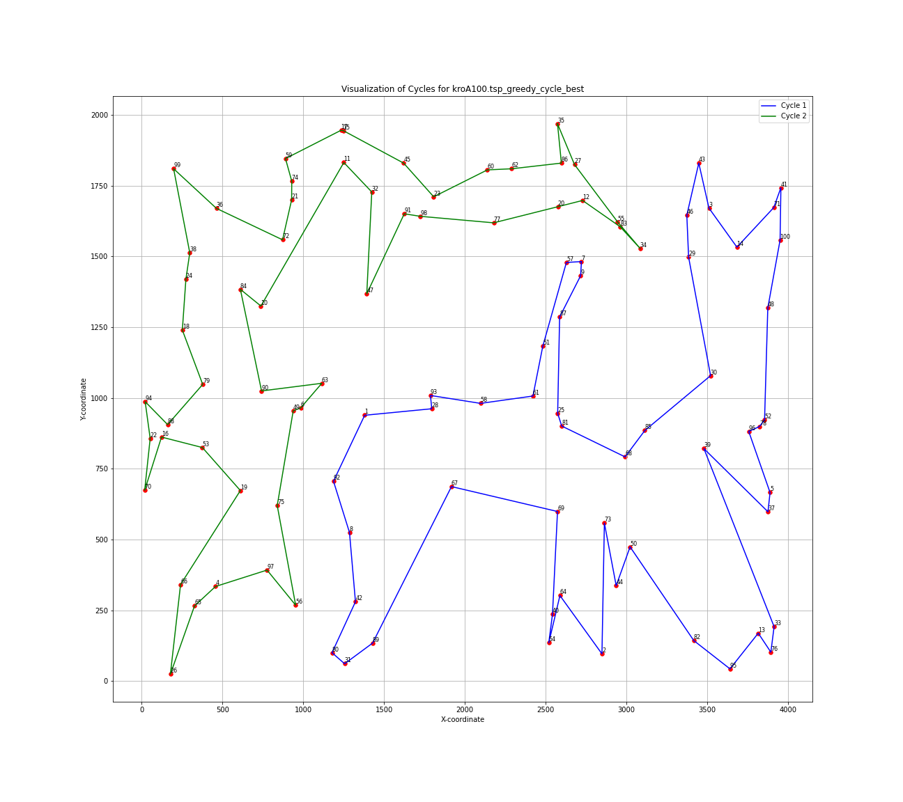
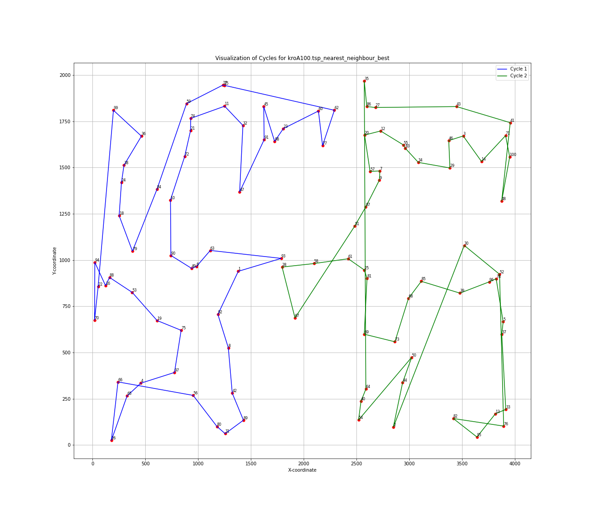
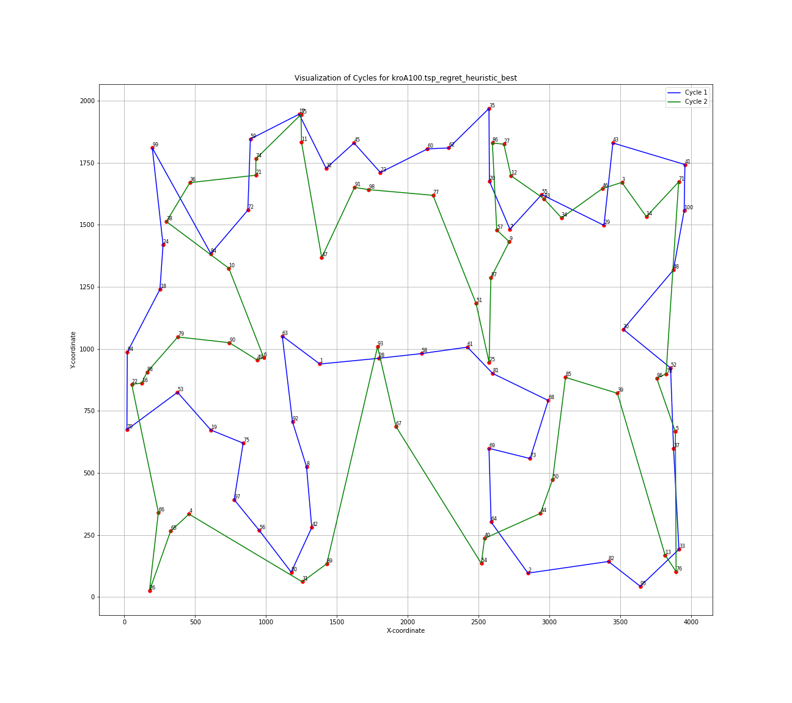

# Sprawozdanie z laboratorium Inteligentne Metody Optymalizacji

Autorzy: Jakub Gołąb, Mariusz Hybiak

## Wprowadzenie
Celem zadania było zaimplementowanie trzech heurystyk rozwiązujących zmodyfikowany problem komiwojazera. Następnie rozwiązania były oceniane na podstawie instancji z biblioteki TSPLib.

## Algorytmy

### Heurystyka najbliższego sąsiada (nearest neighbour)

```pseudocode
Funkcja nearest_neighbour(macierz_odległości):
    dim := Rozmiar(macierz_odległości)
    cykl1 := Pusta lista
    cykl2 := Pusta lista
    odwiedzone := Tablica o rozmiarze dim, zainicjowana wartościami false

    losowy_indeks := Wybierz_losowy_nieodwiedzony_wierzcholek()
    cykl1.dodaj_element(losowy_indeks)
    odwiedzone[losowy_indeks] := true

    najblizszy_sasiad := Wybierz_najblizszego_sasiada(macierz_odległości, losowy_indeks, odwiedzone)
    cykl1.dodaj_element(najblizszy_sasiad)
    odwiedzone[najblizszy_sasiad] := true

    losowy_indeks2 := Wybierz_losowy_nieodwiedzony_wierzcholek()
    cykl2.dodaj_element(losowy_indeks2)
    odwiedzone[losowy_indeks2] := true

    najblizszy_sasiad2 := Wybierz_najblizszego_sasiada(macierz_odległości, losowy_indeks2, odwiedzone)
    cykl2.dodaj_element(najblizszy_sasiad2)
    odwiedzone[najblizszy_sasiad2] := true

    Dopóki nie odwiedzono wszystkich wierzchołków:
        min_odleglosc := MAX_INT
        index_min_odleglosci := -1
        wierzcholek_min_odleglosci := -1

        Dla każdego wierzchołka i w macierz_odległości:
            Jeżeli i nie jest odwiedzony i odległość od bieżącego wierzchołka jest mniejsza niż min_odleglosc:
                min_odleglosc := odległość od bieżącego wierzchołka
                index_min_odleglosci := i
                wierzcholek_min_odleglosci := wierzchołek

        Dodaj wierzchołek_min_odleglosci do cyklu 1
        odwiedzone[wierzcholek_min_odleglosci] := true

        Zresetuj min_odleglosc, index_min_odleglosci i wierzcholek_min_odleglosci

        Dla każdego wierzchołka i w macierz_odległości:
            Jeżeli i nie jest odwiedzony i odległość od bieżącego wierzchołka jest mniejsza niż min_odleglosc:
                min_odleglosc := odległość od bieżącego wierzchołka
                index_min_odleglosci := i
                wierzcholek_min_odleglosci := wierzchołek

        Dodaj wierzchołek_min_odleglosci do cyklu 2
        odwiedzone[wierzcholek_min_odleglosci] := true

    Zwiększ każdy element w cyklu o 1, aby dopasować identyfikator wierzchołka

    Zwróć parę (cykl1, cykl2)
```

### Metoda rozbudowy cyklu (greedy cycle)

```pseudocode
Funkcja greedy_cycle(macierz_odległości):
    dim := Rozmiar(macierz_odległości)
    cykl1 := Pusta lista
    cykl2 := Pusta lista
    odwiedzone := Tablica o rozmiarze dim, zainicjowana wartościami false

    losowy_indeks := Wybierz_losowy_nieodwiedzony_wierzcholek()
    najblizszy_sasiad := Wybierz_najblizszego_sasiada(macierz_odległości, losowy_indeks, odwiedzone)

    cykl1.dodaj_element(losowy_indeks)
    cykl1.dodaj_element(najblizszy_sasiad)
    odwiedzone[losowy_indeks] := true
    odwiedzone[najblizszy_sasiad] := true

    losowy_indeks2 := Wybierz_losowy_nieodwiedzony_wierzcholek()
    najblizszy_sasiad2 := Wybierz_najblizszego_sasiada(macierz_odległości, losowy_indeks2, odwiedzone)

    cykl2.dodaj_element(losowy_indeks2)
    cykl2.dodaj_element(najblizszy_sasiad2)
    odwiedzone[losowy_indeks2] := true
    odwiedzone[najblizszy_sasiad2] := true

    Dopóki nie odwiedzono wszystkich wierzchołków:
        min_odleglosc := MAX_INT
        index_min_odleglosci := -1
        wierzcholek_min_odleglosci := -1

        Dla każdego wierzchołka i w macierz_odległości:
            Jeżeli i nie jest odwiedzony:
                Dla każdej krawędzi w cyklu 1:
                    Oblicz odległość, gdyby i został wstawiony w tej pozycji
                    Jeżeli jest mniejsza niż min_odleglosc:
                        Zaktualizuj min_odleglosc, index_min_odleglosci i wierzcholek_min_odleglosci

        Dodaj wierzcholek_min_odleglosci do cyklu 1
        odwiedzone[wierzcholek_min_odleglosci] := true

        Zresetuj min_odleglosc, index_min_odleglosci i wierzcholek_min_odleglosci

        Dla każdego wierzchołka i w macierz_odległości:
            Jeżeli i nie jest odwiedzony:
                Dla każdej krawędzi w cyklu 2:
                    Oblicz odległość, gdyby i został wstawiony w tej pozycji
                    Jeżeli jest mniejsza niż min_odleglosc:
                        Zaktualizuj min_odleglosc, index_min_odleglosci i wierzcholek_min_odleglosci

        Dodaj wierzcholek_min_odleglosci do cyklu 2
        odwiedzone[wierzcholek_min_odleglosci] := true

    Zwiększ każdy element w cyklu o 1, aby dopasować identyfikator wierzchołka

    Zwróć parę (cykl1, cykl2)
```

### Heurystyki zachłanne oparte na żalu (regret heuristics)

```pseudocode
Funkcja regret_heuristic(macierz_odległości, k=2):
    dim := Rozmiar(macierz_odległości)
    start1 := Wybierz_losowy_nieodwiedzony_wierzcholek()
    start2 := Wybierz_losowy_nieodwiedzony_wierzcholek()

    unvisited_cities := Zbiór wszystkich miast poza start1 i start2

    cykl1 := [start1, start1]
    total_length1 := 0

    cykl2 := [start2, start2]
    total_length2 := 0

    Dopóki cykl1 nie ma rozmiaru dim/2:
        regrets := Pusta lista
        Dla każdego miasta w unvisited_cities:
            insertion_data := Pusta lista
            Dla każdej pozycji i w cyklu1:
                Oblicz długość cyklu po wstawieniu miasta w pozycję i
                Dodaj parę (długość, i) do insertion_data
            Posortuj insertion_data rosnąco według długości
            Jeżeli insertion_data ma co najmniej k elementów:
                regret := długość ostatniego elementu - długość pierwszego elementu
                best_length := długość pierwszego elementu
                best_i := pozycja pierwszego elementu
            W przeciwnym razie:
                regret := -długość pierwszego elementu
                best_length := długość pierwszego elementu
                best_i := pozycja pierwszego elementu
            Dodaj (regret, miasto, best_i, best_length) do regrets
        max_regret := Maksymalny element z regrets
        best_city := miasto z max_regret
        best_i := pozycja z max_regret
        total_length1 := długość cyklu po wstawieniu best_city w pozycję best_i
        Dodaj best_city do cyklu1
        Usuń best_city z unvisited_cities

    Dopóki unvisited_cities nie jest pusty:
        regrets := Pusta lista
        Dla każdego miasta w unvisited_cities:
            insertion_data := Pusta lista
            Dla każdej pozycji i w cyklu2:
                Oblicz długość cyklu po wstawieniu miasta w pozycję i
                Dodaj parę (długość, i) do insertion_data
            Posortuj insertion_data rosnąco według długości
            Jeżeli insertion_data ma co najmniej k elementów:
                regret := długość ostatniego elementu - długość pierwszego elementu
                best_length := długość pierwszego elementu
                best_i := pozycja pierwszego elementu
            W przeciwnym razie:
                regret := -długość pierwszego elementu
                best_length := długość pierwszego elementu
                best_i := pozycja pierwszego elementu
            Dodaj (regret, miasto, best_i, best_length) do regrets
        max_regret := Maksymalny element z regrets
        best_city := miasto z max_regret
        best_i := pozycja z max_regret
        total_length2 := długość cyklu po wstawieniu best_city w pozycję best_i
        Dodaj best_city do cyklu2
        Usuń best_city z unvisited_cities

    Zwiększ każdy element w cyklach o 1, aby dopasować identyfikator wierzchołka

    Zwróć parę (cykl1, cykl2)
```

## Wyniki eksperymentu obliczeniowego

| Instancja   | Metoda            | Średnia (min – max) [jednostki odległości]    |
|-------------|-------------------|-----------------------------|
| kroA100.tsp | Greedy Cycle      | 28824.80 (25716 – 30605)    |
| kroA100.tsp | Nearest Neighbour | 32583.53 (29394 – 36018)    |
| kroA100.tsp | 2-Regret          | 32670.93 (31607 – 34234)    |
| kroB100.tsp | Greedy Cycle      | 28516.11 (25625 – 33105)    |
| kroB100.tsp | Nearest Neighbour | 32246.61 (27886 – 35334)    |
| kroB100.tsp | 2-Regret          | 31875.11 (30616 – 33923)    |


## Wizualizacje najlepszych rozwiązań

| Instancja  | Greedy Cycle | Nearest Neighbour | 2-Regret |
|-----------|--------------|-------------------|------------------|
| kroB100   |  |  |  |
| kroA100   |  |  |  |

## Pomiary czasu

| Instancja | Metoda            | Średnia (min – max) [mikrosekundy]         |
|-----------|-------------------|-------------------------------|
| kroA100   | Greedy Cycle      | 1661.9    (1505 – 2279)       |
| kroA100   | Nearest Neighbour | 7428.58   (6909 – 21053)      |
| kroA100   | 2-Regret          | 35047.51  (32536 – 41120)     |
| kroB100   | Greedy Cycle      | 1668.07   (1503 – 2477)       |
| kroB100   | Nearest Neighbour | 7293.5    (6899 – 12841)      |
| kroB100   | 2-Regret          | 34894.93  (32749 – 46418)     |


## Wnioski

- Metoda Greedy Cycle okazuje się być najbardziej efektywna pod względem średniej sumy długości cykli w porównaniu do dwóch pozostałych metod dla obu instancji problemu.

- Największy zakres wahań (różnica między wartością maksymalną a minimalną) obserwujemy dla metody Nearest Neighbour, co może wskazywać na większą wrażliwość tej metody na specyficzne rozkłady punktów w instancjach problemu. Może to prowadzić do generowania zarówno bardzo dobrych, jak i znacznie słabszych rozwiązań w zależności od konkretnego przypadku.

- Metoda Regret Heuristic prezentuje relatywnie wysokie średnie wartości sumy długości, zbliżone do Nearest Neighbour, jednak z mniejszym zakresem wahań. Jest bardziej stabilna.

- W zależności od sposobu implementacji zmodyfikowanego problemu (czy najpierw konstruowany jest pierwszy cykl, a potem drugi, czy punkty są dodawane na zmianę) cykle mogą się nie przecinać lub "przeplatać". Średnio jednak długości tras są podobne.

- Wykonanie metody Greedy Cycle jest znacząco szybsze w porównaniu do dwóch pozostałych metod (Nearest Neighbour i Regret Heuristic) dla obu instancji problemu. Średnie czasy wykonania dla tej metody są bardzo zbliżone między instancjami, co wskazuje na jej stabilność w różnych środowiskach.

## Kod Programu

Kod programu znajduje się pod [tym linkiem](https://github.com/majsterkovic/imo/blob/main/lab1/tsp/main.cpp) w pliku cpp.
