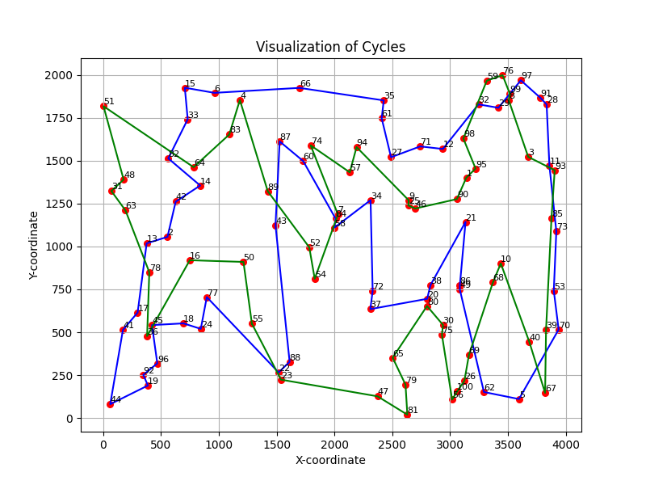
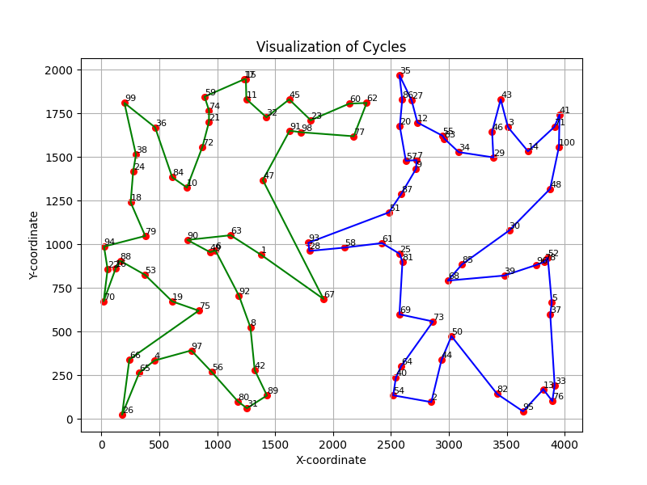
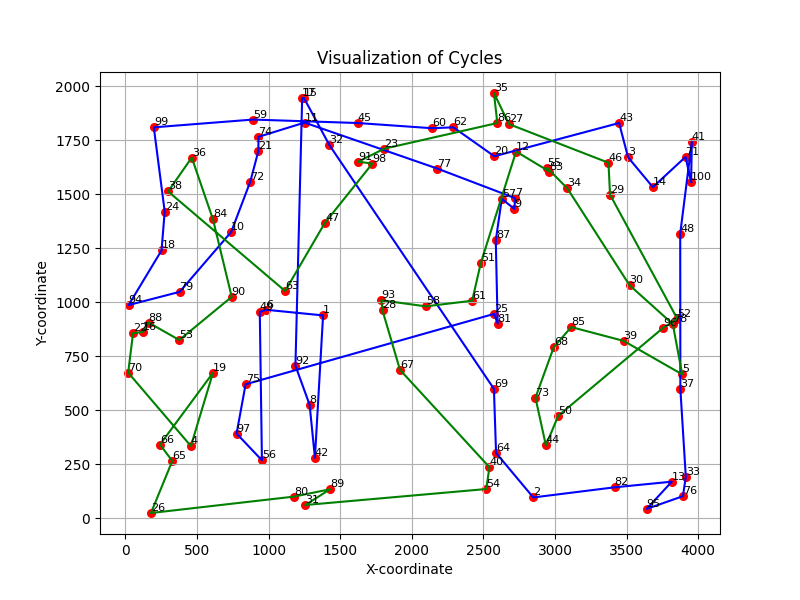
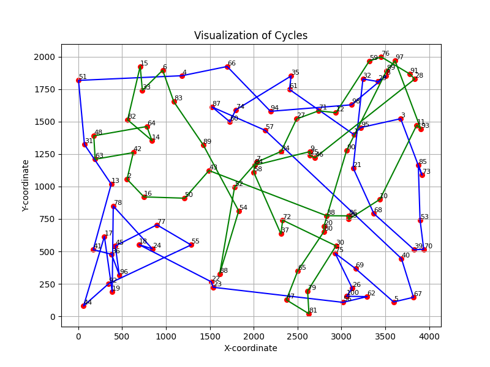
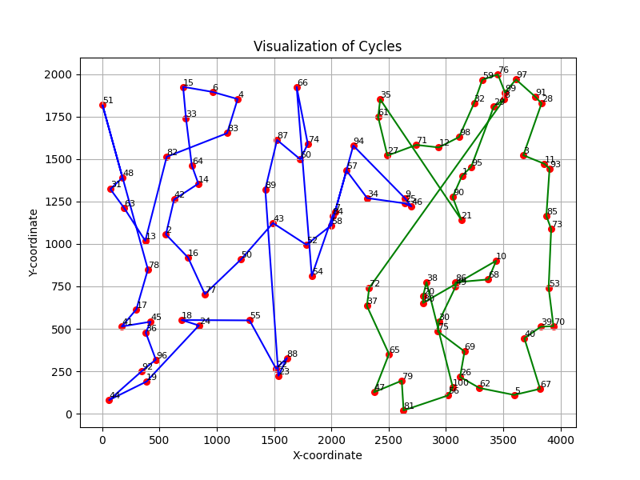
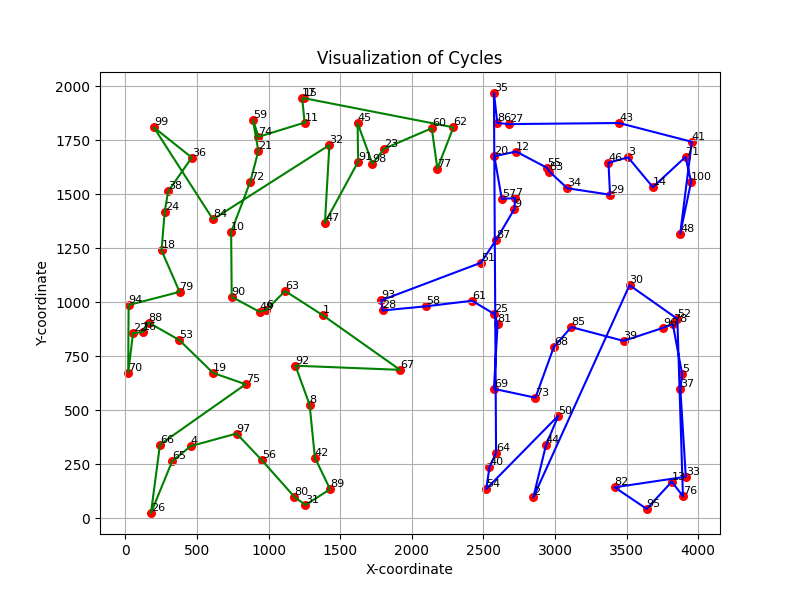
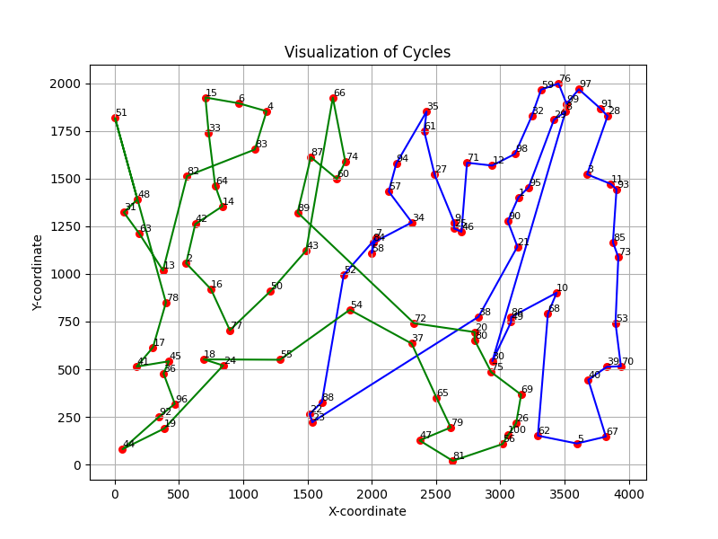

## Sprawozdanie z laboratorium nr 2
# Inteligentne Metody Optymalizacji

Autorzy: Jakub Gołąb, Mariusz Hybiak

### Wprowadzenie
Celem zadania była implementacja algorytmów lokalnego przeszukiwania w wersjach stromej (steepest) i zachłannej (greedy), z dwoma różnym rodzajami sąsiedztwa, starując albo z rozwiązań losowych, albo z rozwiązań uzyskanych za pomocą jednej z heurystyk opracowanych w ramach poprzedniego zadania.

### Algorytmy
Generowanie wszystkich możliwych ruchów w ramach pojedynczego cyklu
```pseudocode
generate_intra_route_inner(cykl):

    ruchy = pusta lista
    rozmiar_cyklu = długość(cykl)

    // Generowanie ruchów odwracających podciągi
    Dla i od 0 do rozmiar_cyklu - 1:
        Dla j od i + 1 do rozmiar_cyklu:
            Dodaj (REVERSE_SUBSEQUENCE, (i, j)) do ruchy

    // Generowanie ruchów zamieniających wierzchołki
    Dla i od 2 do rozmiar_cyklu - 2:
        Dla j od 0 do rozmiar_cyklu:
            Dodaj (SWAP_NODES, (j, (j + i) % rozmiar_cyklu)) do ruchy

    Przemieszaj ruchy

    Zwróć ruchy
```

Lokalne przeszukiwanie metodą stromą w ramach pojedynczego cyklu
```pseudocode
Funkcja local_search_steepest_inner_cycle(początkowy_cykl, dist_mat):
    ruchy = generate_intra_route_inner(początkowy_cykl)
    najlepsza_wartość = -∞

    Powtarzaj:
        Dla każdego indeksu i w zakresie od 0 do długość(ruchy) - 1:
            ruch = ruchy[i]

            Jeśli typ_ruchu == REVERSE_SUBSEQUENCE:
                tmp_cykl = odwróć_podciąg(początkowy_cykl, node1, node2)
                delta = oblicz_delte(początkowy_cykl, tmp_cykl, dist_mat)

            Jeśli typ_ruchu == SWAP_NODES:
                tmp_cykl = zamień_wierzchołki(początkowy_cykl, node1, node2)
                delta = oblicz_delte(początkowy_cykl, tmp_cykl, dist_mat)

            Jeśli delta > najlepsza_wartość:
                najlepsza_wartość = delta
                najlepszy_indeks = i

        Jeśli najlepsza_wartość > 0:
            Zastosuj ruch z najlepszy_indeks
        W przeciwnym razie:
            Przerwij pętlę

    Zwróć finalny_cykl

```

Lokalne przeszukiwanie metodą zachłanną w ramach pojedynczego cyklu
```pseudocode
 local_search_greedy_inner_cycle(początkowy_cykl, dist_mat):

    ruchy = generate_intra_route_inner(początkowy_cykl)

    Powtarzaj:
        najlepsza_wartość = -∞
        Dla każdego i od 0 do długość(ruchy) - 1:
            ruch = ruchy[i]

            Jeśli typ_ruchu == REVERSE_SUBSEQUENCE:
                tmp_cykl = odwróć_podciąg(początkowy_cykl, node1, node2)
                delta = oblicz_delte(początkowy_cykl, tmp_cykl, dist_mat)
            Albo jeśli typ_ruchu == SWAP_NODES:
                tmp_cykl = zamień_wierzchołki(początkowy_cykl, node1, node2)
                delta = oblicz_delte(początkowy_cykl, tmp_cykl, dist_mat)

            Jeśli delta > najlepsza_wartość:
                najlepsza_wartość = delta
                najlepszy_indeks = i
                Przerwij pętlę for

        Jeśli najlepsza_wartość > 0:
            Zastosuj ruch określony przez najlepszy_indeks na początkowy_cykl
        W przeciwnym razie:
            Przerwij pętlę while

    Zwróć początkowy_cykl jako finalny_cykl

```
Lokalne przeszukiwanie metodą stromą z wymianami między cyklami
```pseudocode
local_search_steepest_between(cycle_1, cycle_2, dist_mat):

    moves = generuj wszystkie możliwe wymiany wierzchołków między cyklami
    najlepsza_wartość = 0
    najlepszy_indeks = -1

    dopóki prawda:
        dla każdego ruchu z listy ruchów:
            wykonaj ruch
            oblicz deltę między subdystansami przed i po wykonaniu ruchu

            jeżeli delta > najlepsza_wartość:
                najlepsza_wartość = delta
                najlepszy_indeks = indeks aktualnego ruchu

        jeżeli najlepsza_wartość > 0:
            wykonaj najlepszy ruch
        w przeciwnym razie:
            przerwij pętlę

    zwróć (cycle_1, cycle_2)

```

Lokalne przeszukiwanie metodą zachłanną z wymianami między cyklami
```pseudocode
local_search_greedy_between(cycle_1, cycle_2, dist_mat):

    moves = generuj wszystkie możliwe wymiany wierzchołków między cyklami
    najlepsza_wartość = 0
    najlepszy_indeks = -1

    dopóki prawda:
        dla każdego ruchu z listy ruchów:
            wykonaj ruch
            oblicz deltę między subdystansami przed i po wykonaniu ruchu

            jeżeli delta > najlepsza_wartość:
                najlepsza_wartość = delta
                najlepszy_indeks = indeks aktualnego ruchu
                przerwij pętlę

        jeżeli najlepsza_wartość > 0:
            wykonaj najlepszy ruch
        w przeciwnym razie:
            przerwij pętlę

    zwróć (cycle_1, cycle_2)
```

Losowe błądzenie
```pseudocode
random_search_cycle(starting_cycle, dist_mat):

    moves = generuj wszystkie możliwe ruchy wewnątrz trasy

    dopóki czas < time_limit_microseconds:
        weź pierwszy ruch z listy

        jeżeli typ ruchu == REVERSE_SUBSEQUENCE:
            odwróć podciąg
        jeżeli typ ruchu == SWAP_NODES:
            zamień wierzchołki

    zwróć final_cycle
```

### Wyniki eksperymentu obliczeniowego

W tabeli przedstawiono sumy długości cykli dla każdej z metod dla obu instancji problemu.

| Instancja   | Metoda (wersja / typ wymian / początek) | Średnia (min – max) [jednostki odległości]    |
|-------------|-------------------|-----------------------------|
| kroA100 | steepest inner random | 33850.48 (30748 - 37235) |
| kroA100 | steepest inner heuristic | 26816.29 (23281 - 30188) |
| kroA100 | steepest between random | 52106.15 (38477 - 65723) |
| kroA100 | steepest between heuristic | 31614.32 (28693 - 35183) |
| kroA100 | greedy inner random | 34626.56 (32004 - 37591) |
| kroA100 | greedy inner heuristic | 27355.74 (23205 - 30087) |
| kroA100 | greedy between random | 43523.76 (34830 - 55226) |
| kroA100 | greedy between heuristic | 31979.32 (28842 - 35430) |
| kroA100 | random inner heuristic | 137510.65 (105824 - 181527) |
| kroB100 | steepest inner random | 34322.2 (31362 - 37957) |
| kroB100 | steepest inner heuristic | 25734.14 (22611 - 28522) |
| kroB100 | steepest between random | 51643.1 (42161 - 63426) |
| kroB100 | steepest between heuristic | 31399.98 (28593 - 34053) |
| kroB100 | greedy inner random | 34657.0 (32734 - 37167) |
| kroB100 | greedy inner heuristic | 26065.38 (23122 - 30020) |
| kroB100 | greedy between random | 43828.14 (36308 - 56298) |
| kroB100 | greedy between heuristic | 31769.62 (29087 - 34343) |
| kroB100 | random inner heuristic | 132748.42 (99536 - 171747) |


### Wizualizacje najlepszych rozwiązań

| Metoda |  KroA100 |   KroB100 |
|--------|----------|-----------|
| steepest inner random |  |  |
| steepest inner heuristic |  |  |
| steepest between random |  |  |
| steepest between heuristic |  |  |
| greedy inner random |  |  |
| greedy inner heuristic |  |  |
| greedy between random |  |  |
| greedy between heuristic |  |  |
| random inner heuristic |  |  |


### Wnioski

- Algorytmy lokalnego przeszukiwania, zarówno w wersji stromej jak i zachłannej, wykazują różnice w skuteczności w zależności od wyboru początkowego rozwiązania oraz rodzaju sąsiedztwa.
- Wykorzystanie heurystyk w początkowych rozwiązaniach znacząco poprawia efektywność algorytmów, szczególnie widoczne jest to w przypadku metodfy stromej.
- Local search w wersji stromej osiąga zazwyczaj lepsze wyniki od metody zachłannej, co sugeruje, że bardziej dogłębne przeszukiwanie sąsiedztwa przynosi korzyści w przypadku tego konkretnego problemu.


### Kod Programu

Kod programu znajduje się pod [tym linkiem](https://github.com/majsterkovic/imo/blob/main/lab2/) w pliku cpp.
