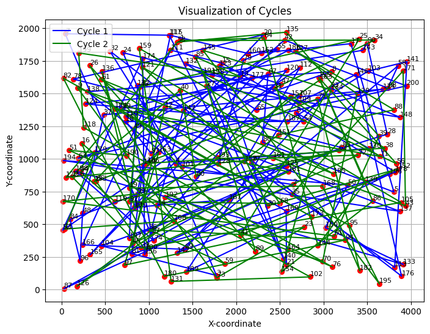
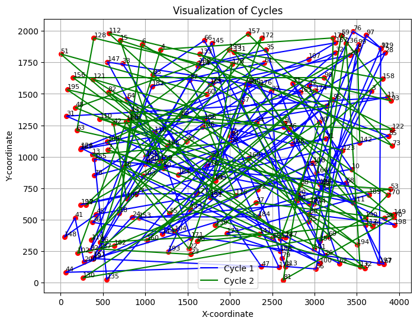
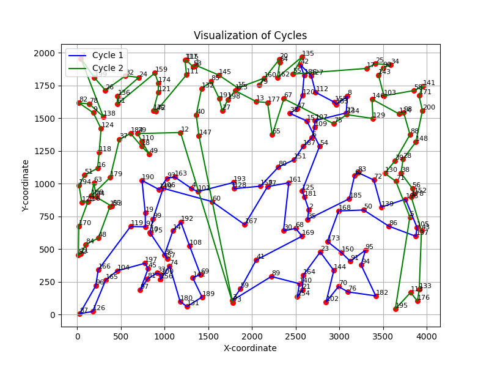
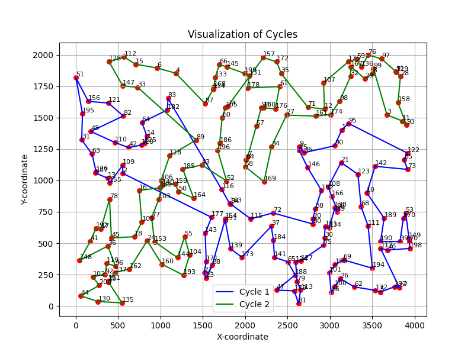
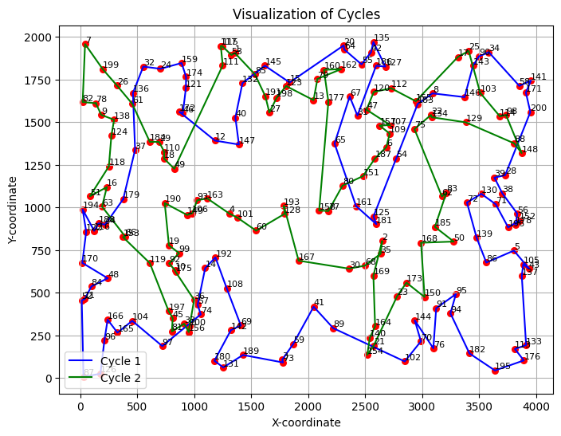
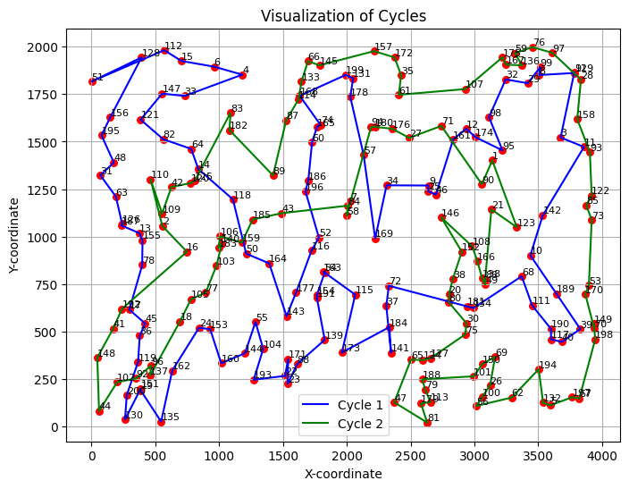
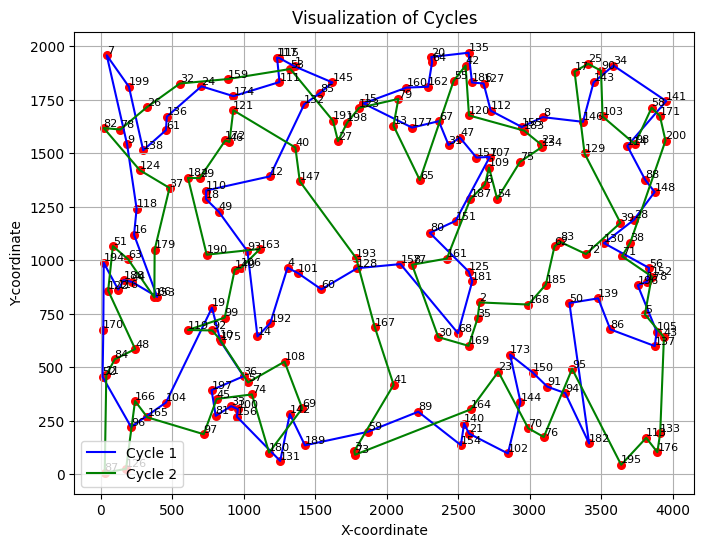
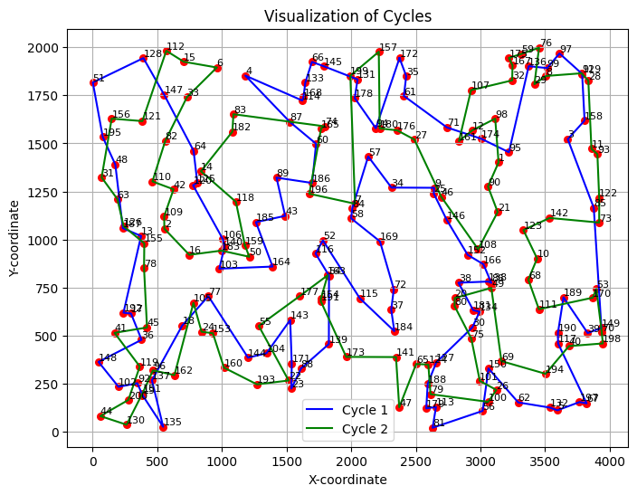
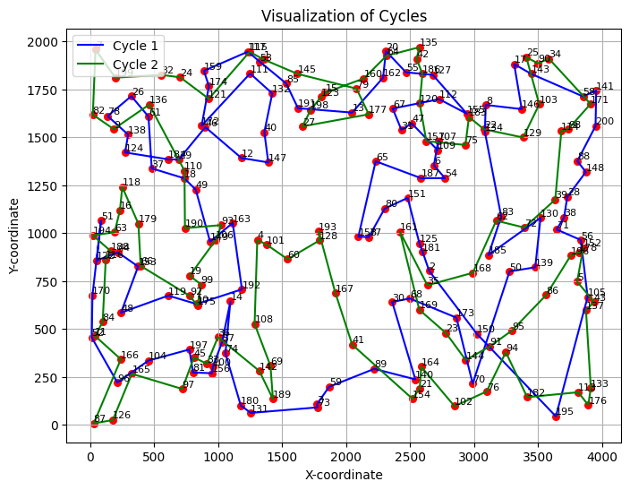
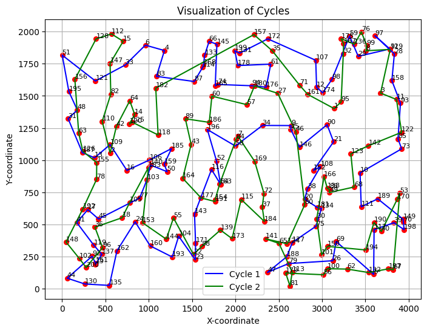

## Sprawozdanie z laboratorium nr 3
# Inteligentne Metody Optymalizacji

Autorzy: Jakub Gołąb, Mariusz Hybiak

### Wprowadzenie
Celem zadania była poprawa efektywności algorytmów lokalnego przeszukiwania z poprzedniego zadania. W celu poprawy efektywności czasowe wykorzystano oceny ruchów z poprzednich iteracji i ruchów kandydackich.

### Algorytmy
#### Algorytm oparty o ruchy kandydackie
```pseudocode

function candidate_moves_algorithm(cycle1, cycle2, k=10):
    closest = compute_k_closest_neighbours(distance, k)

    while True:
        for i = 1 to num_cities:
            for j in closest[i]:

                i_in_cycle1, pos_i = find_city(cycle1, cycle2, i)
                j_in_cycle1, pos_j = find_city(cycle1, cycle2, j)

                pos_i_succ = pos_i+1
                pos_j_succ = pos_j+1

                pos_i_pred = pos_i-1
                pos_j_pred = pos_j-1

                if (i_in_cycle1 and j_in_cycle1):

                    distance_before_succ = distance[i][cycle1[pos_i_succ]] + distance[j][cycle1[pos_j_succ]]
                    distance_after_succ = distance[i][j] + distance[cycle1[pos_i_succ]][cycle1[pos_j_succ]]

                    distance_before_pred = distance[i][cycle1[pos_i_pred]] + distance[j][cycle1[pos_j_pred]]
                    distance_after_pred = distance[i][j] + distance[cycle1[pos_i_pred]][cycle1[pos_j_pred]]

                elif (i_in_cycle1 is False and j_in_cycle1 is False):

                    distance_before_succ = distance[i][cycle2[pos_i_succ]] + distance[j][cycle2[pos_j_succ]]
                    distance_after_succ = distance[i][j] + distance[cycle2[pos_i_succ]][cycle2[pos_j_succ]]

                    distance_before_pred = distance[i][cycle2[pos_i_pred]] + distance[j][cycle2[pos_j_pred]]
                    distance_after_pred = distance[i][j] + distance[cycle2[pos_i_pred]][cycle2[pos_j_pred]]

                delta_succ = distance_after_succ - distance_before_succ
                delta_pred = distance_after_pred - distance_before_pred
                
                delta = min(delta_pred, delta_succ)
                which_delta = argmin([delta_succ, delta_pred])

                if best_delta > delta:
                    best_delta = delta
                    
                    if which_delta == 0:
                        pos = (pos_i_succ, pos_j)
                    elif which_delta == 1:
                        pos = (pos_i, pos_j_pred)
                        
                    if (i_in_cycle1 and j_in_cycle1):
                        best_move = (SWAP_EDGES_WITHIN_CYCLE_1, pos)
                    elif (i_in_cycle1 is False and j_in_cycle1 is False):
                        best_move = (SWAP_EDGES_WITHIN_CYCLE_2, pos)
                        
        if best_move is None:
            break

        cycle1, cycle2 = apply_move(best_move, cycle1, cycle2)
    
    return cycle1, cycle2
```
#### Algorytm oparty o oceny ruchów z poprzednich iteracji
```pseudocode
function rank_move_coords(move_with_coords, distance):
    (a, b), (c, d), move = move_with_coords
    distance_before = distance[a][b] + distance[c][d]
    distance_after = distance[a][c] + distance[b][d]
    rank = distance_after - distance_before
    return (a, b), (c, d), move, rank

function remove_marked(moves, banned_edges):
    return [m for m in moves if m[0] not in banned_edges and m[1] not in banned_edges]

function create_new_moves(cycle, allowed_edges, move_type):

    for i = 0 to len(cycle) - 1:
        j = (i + 1) % len(cycle)
        edges.append(((cycle[i], cycle[j]), (i, j)))
    
    for i = 0 to len(edges) - 1:
        for j = 0 to len(edges) - 1:
            if i == j:
                continue
            if edges[i][0] in allowed_edges or edges[j][0] in allowed_edges:
                (a, b), coords_0 = edges[i]
                (c, d), coords_1 = edges[j]
                if a == c or a == d or b == c or b == d:
                    continue
                move = (move_type, (coords_0[1], coords_1[0]))
                combinations.append(((a,b), (c,d), move))

    ranked_combinations = rank_moves(combinations)
    return ranked_combinations
    

function cache_moves_algorithm(cycle1, cycle2):
    ranked_moves = generate_all_cache_moves(cycle1, cycle2)
    
    while True:
  
        appliable_move = None
        banned_edges = set()
        allowed_edges = set()

        for ranked_move in ranked_moves:
            (a, b), (c, d), move_type, (_, _) = ranked_move
       
            if move_type == SWAP_EDGES_WITHIN_CYCLE_1:
                edges_in_c1 = find_edges_in_cycle((a, b), (c, d), cycle1)
            
            if move_type == SWAP_EDGES_WITHIN_CYCLE_2: 
                edges_in_c2 = find_edges_in_cycle((a, b), (c, d), cycle2)
            
            if edges_in_c1 is not None:
                appliable_move = (move_type, edges_in_c1)
                banned_edges.add((a, b))
                banned_edges.add((c, d))
                allowed_edges.add((a, c))
                allowed_edges.add((b, d))
                break

            if edges_in_c2 is not None:
                appliable_move = (move_type, edges_in_c2)
                banned_edges.add((a, b))
                banned_edges.add((c, d))
                allowed_edges.add((a, c))
                allowed_edges.add((b, d))
                break

        if appliable_move is None:
            break
        else:
            cycle1, cycle2 = apply_move(appliable_move, cycle1, cycle2)

        ranked_moves = remove_marked(ranked_moves, banned_edges)
        new = generate_all_new_moves(allowed_edges, cycle1, cycle2)
        ranked_moves.extend(new)

    return cycle1, cycle2
```
### Wyniki eksperymentu obliczeniowego
W tabeli przedstawiono sumy długości cykli dla każdej z metod dla obu instancji problemu.

<div>
<table border="1" class="dataframe">
  <thead>
    <tr>
      <th></th>
      <th></th>
      <th colspan="3" halign="left">Długość cyklu</th>
    </tr>
    <tr>
      <th></th>
      <th></th>
      <th>min</th>
      <th>mean</th>
      <th>max</th>
    </tr>
    <tr>
      <th>Instancja</th>
      <th>Algorytm</th>
      <th></th>
      <th></th>
      <th></th>
    </tr>
  </thead>
  <tbody>
    <tr>
      <th rowspan="3" valign="top">kroA200.tsp</th>
      <th>Lokalne przeszukiwanie z pamięcią</th>
      <td>46460.374</td>
      <td>51170.044</td>
      <td>57510.783</td>
    </tr>
    <tr>
      <th>Lokalne przeszukiwanie z ruchami kandydackimi</th>
      <td>42479.010</td>
      <td>46868.385</td>
      <td>50665.481</td>
    </tr>
    <tr>
      <th>Lokalne przeszukiwanie w wersji stromej</th>
      <td>37402.709</td>
      <td>39865.420</td>
      <td>42287.448</td>
    </tr>
    <tr>
      <th rowspan="3" valign="top">kroB200.tsp</th>
      <th>Lokalne przeszukiwanie z pamięcią</th>
      <td>46727.067</td>
      <td>51099.903</td>
      <td>57312.229</td>
    </tr>
    <tr>
      <th>Lokalne przeszukiwanie z ruchami kandydackimi</th>
      <td>44043.445</td>
      <td>46479.567</td>
      <td>49834.288</td>
    </tr>
    <tr>
      <th>Lokalne przeszukiwanie w wersji stromej</th>
      <td>37046.046</td>
      <td>39829.242</td>
      <td>42067.887</td>
    </tr>
  </tbody>
</table>
</div>

### Czas działania algorytmu
W tabeli przedstawiono średni czas działania algorytmu.

<div>
<table border="1" class="dataframe">
  <thead>
    <tr>
      <th></th>
      <th></th>
      <th colspan="3" halign="left">Czas wykonania</th>
    </tr>
    <tr>
      <th></th>
      <th></th>
      <th>min</th>
      <th>mean</th>
      <th>max</th>
    </tr>
    <tr>
      <th>Instancja</th>
      <th>Algorytm</th>
      <th></th>
      <th></th>
      <th></th>
    </tr>
  </thead>
  <tbody>
    <tr>
      <th rowspan="3" valign="top">kroA200.tsp</th>
      <th>Lokalne przeszukiwanie z pamięcią</th>
      <td>1.552</td>
      <td>3.070</td>
      <td>9.835</td>
    </tr>
    <tr>
      <th>Lokalne przeszukiwanie z ruchami kandydackimi</th>
      <td>4.056</td>
      <td>6.391</td>
      <td>17.287</td>
    </tr>
    <tr>
      <th>Lokalne przeszukiwanie w wersji stromej</th>
      <td>8.935</td>
      <td>13.918</td>
      <td>36.904</td>
    </tr>
    <tr>
      <th rowspan="3" valign="top">kroB200.tsp</th>
      <th>Lokalne przeszukiwanie z pamięcią</th>
      <td>1.382</td>
      <td>2.981</td>
      <td>8.683</td>
    </tr>
    <tr>
      <th>Lokalne przeszukiwanie z ruchami kandydackimi</th>
      <td>4.090</td>
      <td>6.337</td>
      <td>16.803</td>
    </tr>
    <tr>
      <th>Lokalne przeszukiwanie w wersji stromej</th>
      <td>8.634</td>
      <td>13.565</td>
      <td>34.762</td>
    </tr>
  </tbody>
</table>
</div>


### Wizualizacje najlepszych rozwiązań
| Metoda |  KroA200 |   KroB200 |
|--------|----------|-----------|
| Random |  |  |
| Heurystyczna (greedy cycle) |  |  |
| Lokalne przeszukiwanie w wersji stromej |  |  |
| Lokalne przesukiwanie z ruchami kandydackimi |  |  |
| Lokalne przeszukiwanie z pamięcią |  |  |

### Wnioski
- Wprowadzenie ocen ruchów z poprzednich iteracji przyspieszyło proces przeszukiwania przestrzeni rozwiązań. Dzięki temu algorytmy lokalnego przeszukiwania mogą szybciej zbliżać się do optymalnego rozwiązania, eliminując zbędne iteracje.
- Wśród testowanych strategii, algorytm korzystający z ocen ruchów z poprzednich iteracji wykazał się najlepszą wydajnością. Oznacza to, że uwzględnienie historii ocen pozwala lepiej kierować procesem przeszukiwania, wybierając bardziej obiecujące ruchy.
- Algorytm z ruchami kandydackimi również okazał się skuteczny, choć nieco mniej efektywny od strategii z pamięcią. Niemniej jednak, w porównaniu do podstawowego algorytmu lokalnego przeszukiwania, pozwala on na znaczne przyspieszenie procesu optymalizacji.
- Im krócej działa algorytm, tym jakość rozwiązania jest gorsza. Nie jest to jednak prosta proporcja.

### Kod programu

Kod programu znajduje się pod [tym linkiem](https://github.com/majsterkovic/imo/blob/main/lab3/).