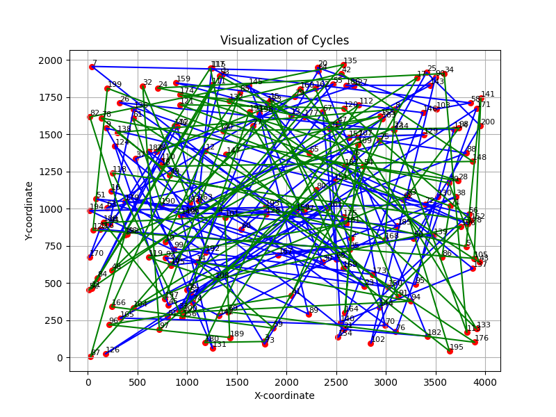
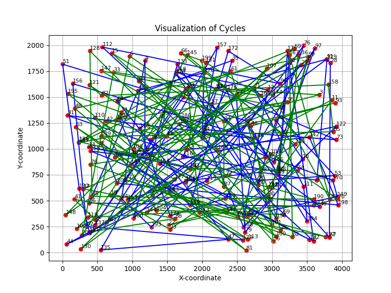
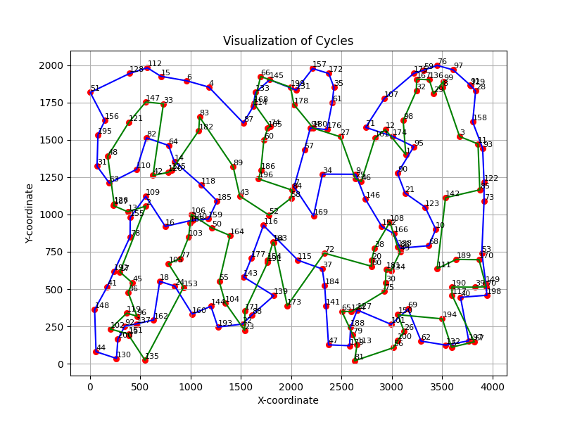
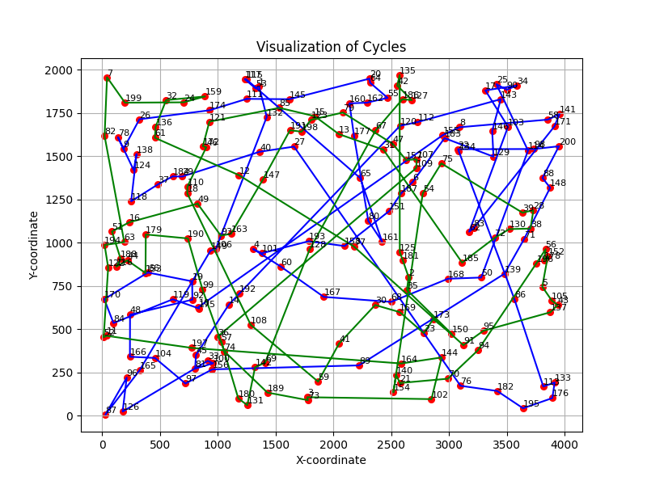
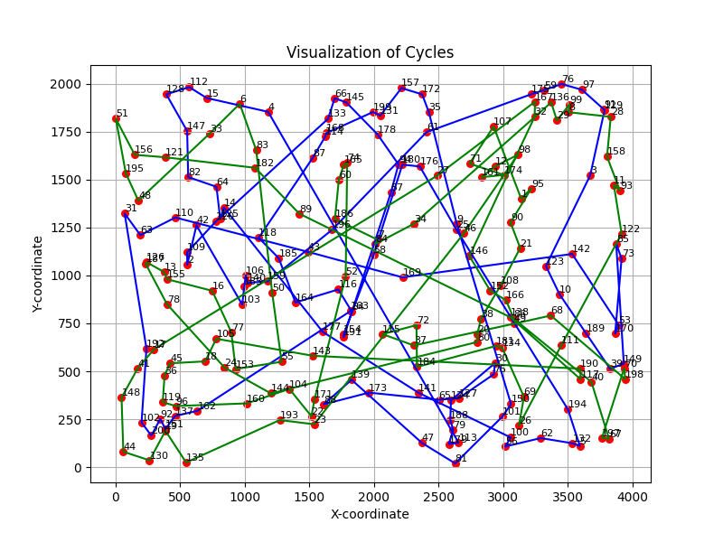
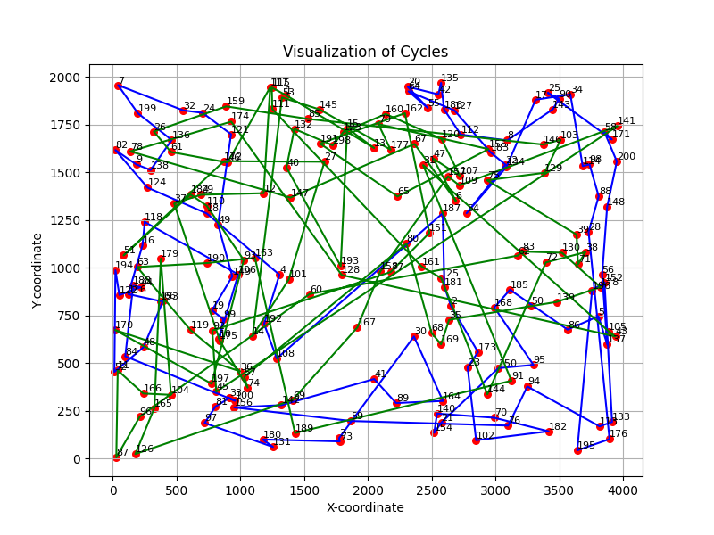
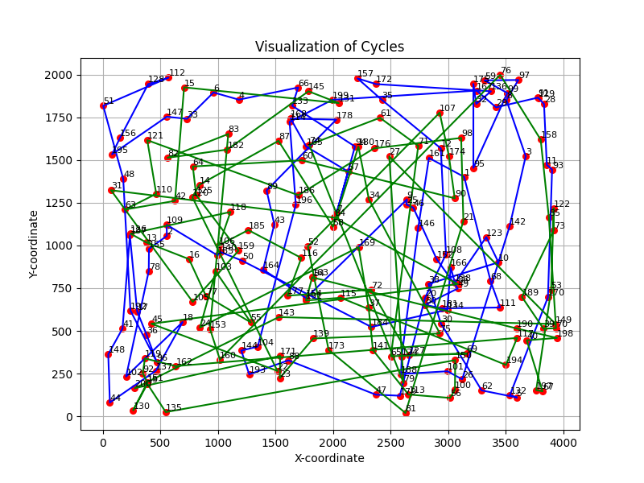
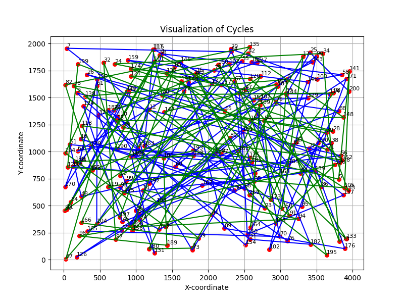
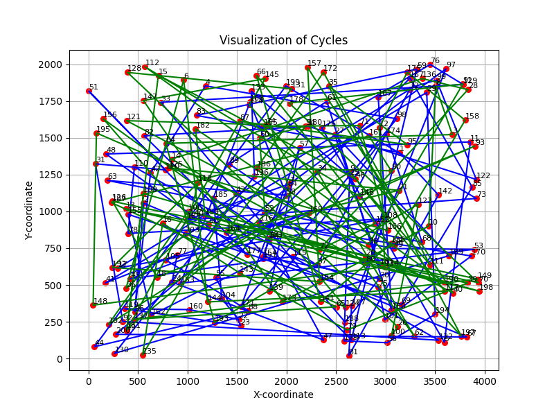

## Sprawozdanie z laboratorium nr 3
# Inteligentne Metody Optymalizacji

Autorzy: Jakub Gołąb, Mariusz Hybiak

### Wprowadzenie
Celem zadania była poprawa efektywności algorytmów lokalnego przeszukiwania z poprzedniego zadania. W celu poprawy efektywności czasowe wykorzystano oceny ruchów z poprzednich iteracji i ruchów kandydackich.

### Algorytmy
```pseudocode
// Algorytm oparty o ruchy kandydackie
candidate_moves_algorithm(cycle1, cycle2, dist_mat, k):
    k_closest_set = compute_closest_cities(dist_mat, k)
    while true
        best_delta = 0
        best_move = NULL
        for node_a in all_cities:
            for node_b in k_closest_set[node_a]:
                c1, pos1 = find(node_a, cycle1, cycle2)
                c2, pos2 = find(node_b, cycle1, cycle2)
                if c1 == c2:
                    move = swap_edge(node_a, succesor(node_a)) + swap_edge(node_b, succesor(node_b))
                else
                    move = swap_nodes(node_a, node_b)
                delta = compute_delta(move)
                if delta > best_delta:
                    best_delta = delta
                    best_move = move
        if best_move is NULL:
            break
        apply_move(best_move)
        
    return (cycle1, cycle2)
```

```pseudocode
\\ algorytm oparty o oceny ruchów z poprzednich iteracji
```

### Wyniki eksperymentu obliczeniowego

W tabeli przedstawiono sumy długości cykli dla każdej z metod dla obu instancji problemu.

| Instancja   | Metoda            | Średnia (min – max) [jednostki odległości]    |
|-------------|-------------------|-----------------------------|
| kroA200 | random | 343397.4 (325622 - 367592) |
| kroA200 | heuristic | 42647.1 (41003 - 43990) |
| kroA200 | local_search_steepest | 84107.5 (73714 - 103386) |
| kroA200 | candidate_moves | 119163.6 (97614 - 136954) |
| kroA200 | cache_moves | 335248.9 (306820 - 353120) |
| kroB200 | random | 337828.5 (326222 - 361247) |
| kroB200 | heuristic | 42083.0 (40871 - 43710) |
| kroB200 | local_search_steepest | 81853.3 (74057 - 88471) |
| kroB200 | candidate_moves | 134144.1 (109662 - 169742) |
| kroB200 | cache_moves | 335300.5 (310480 - 352315) |


### Czas działania algorytmu

W tabeli przedstawiono średni czas działania algorytmu.

| Instancja   | Metoda            | Średnia (min – max) [milisekundy] |
|-------------|-------------------|-----------------------------------|
| kroA200 | heuristic | 276280.9 (257958 - 369437) |
| kroA200 | local_search_steepest | 25743204.7 (19735387 - 29716978) |
| kroA200 | candidate_moves | 3738071.4 (2645683 - 5224432) |
| kroA200 | cache_moves | 110838.1 (72426 - 199158) |
| kroB200 | heuristic | 267744.6 (260291 - 311365) |
| kroB200 | local_search_steepest | 26044757.9 (19782866 - 32359997) |
| kroB200 | candidate_moves | 3275410.4 (2526119 - 4147063) |
| kroB200 | cache_moves | 87820.4 (64392 - 115929) |


### Wizualizacje najlepszych rozwiązań

| Metoda |  KroA100 |   KroB100 |
|--------|----------|-----------|
| random |  |  |
| heuristic |  |  |
| local_search_steepest |  |  |
| candidate_moves |  |  |
| cache_moves |  |  |


### Wnioski

- Wprowadzenie ocen ruchów z poprzednich iteracji przyspieszyło proces przeszukiwania przestrzeni rozwiązań. Dzięki temu algorytmy lokalnego przeszukiwania mogą szybciej zbliżać się do optymalnego rozwiązania, eliminując zbędne iteracje.
- Wśród testowanych strategii, algorytm korzystający z ocen ruchów z poprzednich iteracji wykazał się najlepszą wydajnością. Oznacza to, że uwzględnienie historii ocen pozwala lepiej kierować procesem przeszukiwania, wybierając bardziej obiecujące ruchy.


### Kod Programu

Kod programu znajduje się pod [tym linkiem](https://github.com/majsterkovic/imo/blob/main/lab3/) w pliku cpp.
