## Sprawozdanie z laboratorium nr 2
# Inteligentne Metody Optymalizacji

Autorzy: Jakub Gołąb, Mariusz Hybiak

### Wprowadzenie
Celem zadania była implementacja algorytmów lokalnego przeszukiwania w wersjach stromej (steepest) i zachłannej (greedy), z dwoma różnym rodzajami sąsiedztwa, starując albo z rozwiązań losowych, albo z rozwiązań uzyskanych za pomocą jednej z heurystyk opracowanych w ramach poprzedniego zadania.

### Algorytmy
```pseudocode
// Generowanie wszystkich możliwych ruchów w ramach pojedynczego cyklu
generate_intra_route_inner(cycle):
    moves = pusta lista
    cycle_size = rozmiar(cycle)

    // Generowanie ruchów odwracających podciągi
    dla i od 0 do cycle_size-1:
        dla j od i+1 do cycle_size:
            dodaj (REVERSE_SUBSEQUENCE, (i, j)) do moves

    // Generowanie ruchów zamieniających wierzchołki
    dla i od 2 do cycle_size-2:
        dla j od 0 do cycle_size:
            dodaj (SWAP_NODES, (j, (j+i) % cycle_size)) do moves

    // Losowe przemieszanie listy ruchów
    przemieszaj moves

    zwróć moves
```

```pseudocode
// Lokalne przeszukiwanie metodą stromą w ramach pojedynczego cyklu
local_search_steepest_inner_cycle(starting_cycle, dist_mat):
    moves = generate_intra_route_inner(starting_cycle)
    tmp_cycle = kopia starting_cycle
    best_index = -1
    best_value = 0

    while true:
        best_index = -1
        best_value = 0

        // Dla każdego ruchu z listy ruchów
        dla każdego i od 0 do rozmiar(moves)-1:
            move = moves[i]
            node1 = move.pierwszy_cykl
            node2 = move.drugi_cykl
            type = move.typ_ruchu

            // Obliczanie nowego cyklu i wartości zmiany
            jeżeli type == REVERSE_SUBSEQUENCE:
                tmp_cycle = odwróć_podciąg(starting_cycle, node1, node2)
                delta = oblicz_delte(starting_cycle, tmp_cycle)
            jeżeli type == SWAP_NODES:
                tmp_cycle = zamień_wierzchołki(starting_cycle, node1, node2)
                delta = oblicz_delte(starting_cycle, tmp_cycle)
            // Jeżeli wartość zmiany jest większa od najlepszej wartości dotychczas
            jeżeli delta > best_value:
                best_value = delta
                best_index = i

        // Jeżeli istnieje lepszy ruch, zastosuj go
        jeżeli best_value > 0:
            move = moves[best_index]
            zastosuj move
            del(moves[best_index])
        w przeciwnym razie:
            przerwij pętlę

    zwróć starting_cycle
```

```pseudocode
local_search_greedy_inner_cycle(starting_cycle, dist_mat):
    moves = generate_intra_route_inner(starting_cycle)
    tmp_cycle = kopia starting_cycle
    best_index = -1
    best_value = 0

    // Losowe przemieszanie listy ruchów
    przemieszaj moves

    // Dla każdego ruchu z listy ruchów
    dla każdego i od 0 do rozmiar(moves)-1:
        move = moves[i]
        node1 = move.drugi.pierwszy
        node2 = move.drugi.drugi
        type = move.pierwszy

        // Obliczanie nowego cyklu i wartości zmiany
        jeżeli type == REVERSE_SUBSEQUENCE:
            tmp_cycle = odwróć_podciąg(starting_cycle, node1, node2)
            delta = oblicz_delte(starting_cycle, tmp_cycle)
        jeżeli type == SWAP_NODES:
            tmp_cycle = zamień_wierzchołki(starting_cycle, node1, node2)
            delta = oblicz_delte(starting_cycle, tmp_cycle)
        // Jeżeli wartość zmiany jest większa od najlepszej wartości dotychczas
        jeżeli delta > best_value:
            best_value = delta
            best_index = i
            zastosuj ruch move

    zwróć starting_cycle
```

### Wyniki eksperymentu obliczeniowego

W tabeli przedstawiono sumy długości cykli dla każdej z metod dla obu instancji problemu.

| Instancja   | Metoda            | Średnia (min – max) [jednostki odległości]    |
|-------------|-------------------|-----------------------------|
| kroA100 | steepest inner random | 33850.48 (30748 - 37235) |
| kroA100 | steepest inner heuristic | 26816.29 (23281 - 30188) |
| kroA100 | steepest between random | 52106.15 (38477 - 65723) |
| kroA100 | steepest between heuristic | 31614.32 (28693 - 35183) |
| kroA100 | greedy inner random | 34626.56 (32004 - 37591) |
| kroA100 | greedy inner heuristic | 27355.74 (23205 - 30087) |
| kroA100 | greedy between random | 43523.76 (34830 - 55226) |
| kroA100 | greedy between heuristic | 31979.32 (28842 - 35430) |
| kroA100 | random inner heuristic | 137510.65 (105824 - 181527) |
| kroB100 | steepest inner random | 34322.2 (31362 - 37957) |
| kroB100 | steepest inner heuristic | 25734.14 (22611 - 28522) |
| kroB100 | steepest between random | 51643.1 (42161 - 63426) |
| kroB100 | steepest between heuristic | 31399.98 (28593 - 34053) |
| kroB100 | greedy inner random | 34657.0 (32734 - 37167) |
| kroB100 | greedy inner heuristic | 26065.38 (23122 - 30020) |
| kroB100 | greedy between random | 43828.14 (36308 - 56298) |
| kroB100 | greedy between heuristic | 31769.62 (29087 - 34343) |
| kroB100 | random inner heuristic | 132748.42 (99536 - 171747) |


### Wizualizacje najlepszych rozwiązań

| Metoda |  KroA100 |   KroB100 |
|--------|----------|-----------|
| steepest inner random | 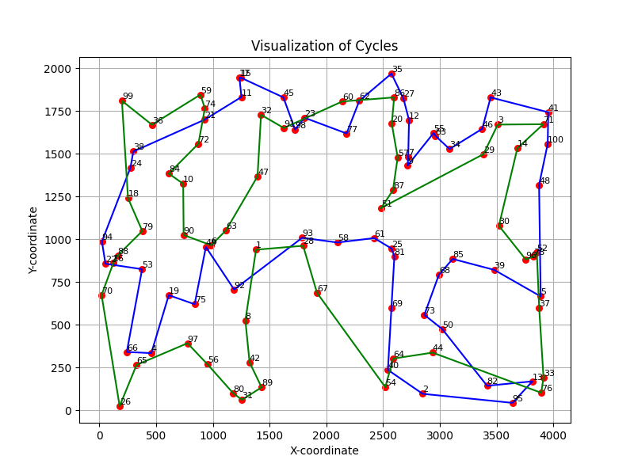 | 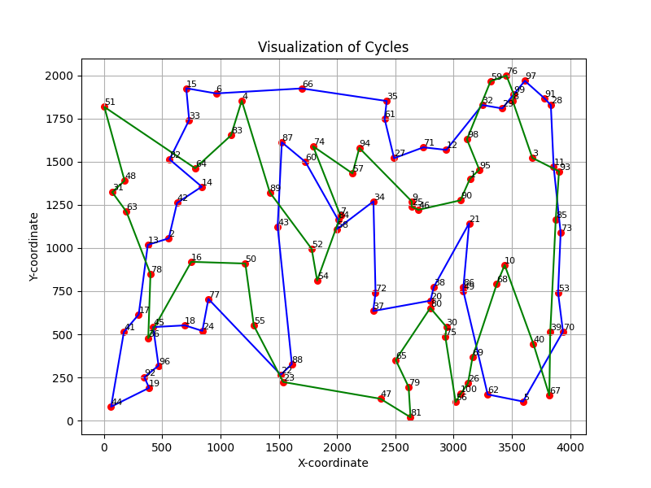 |
| steepest inner heuristic | 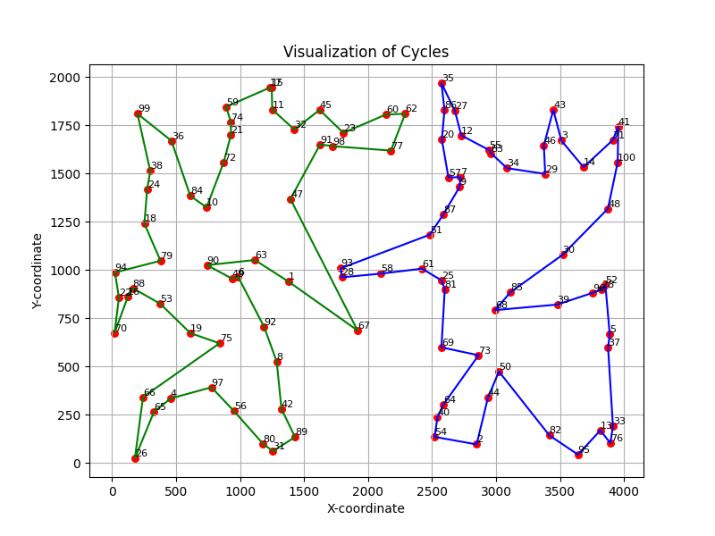 | 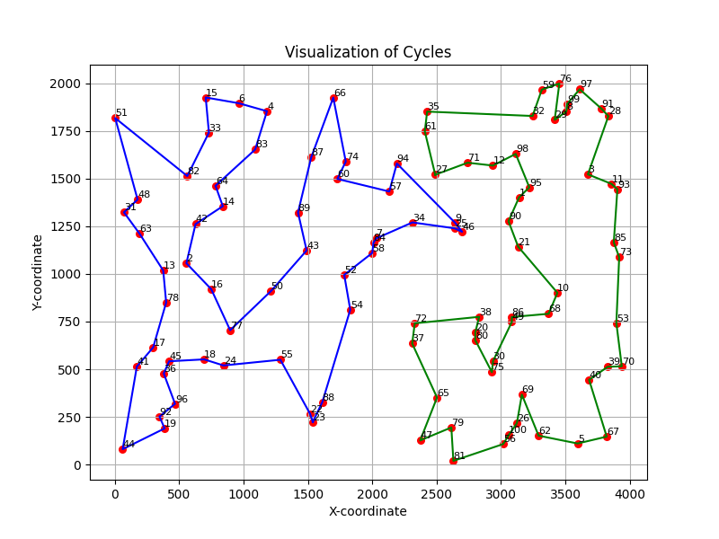 |
| steepest between random | 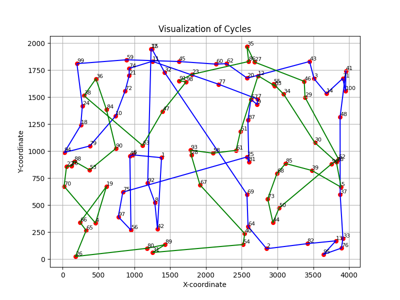 | 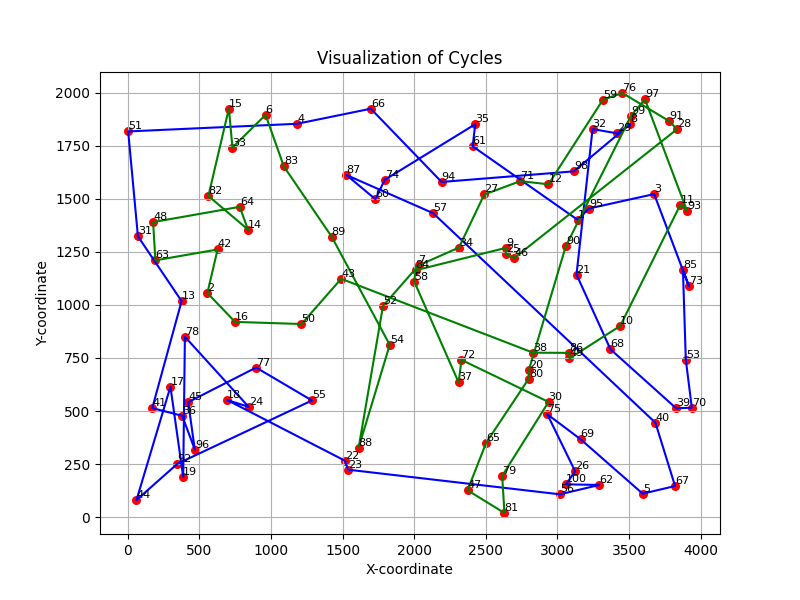 |
| steepest between heuristic | 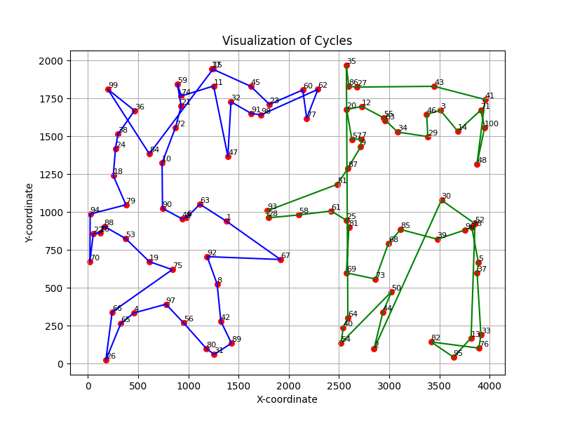 | 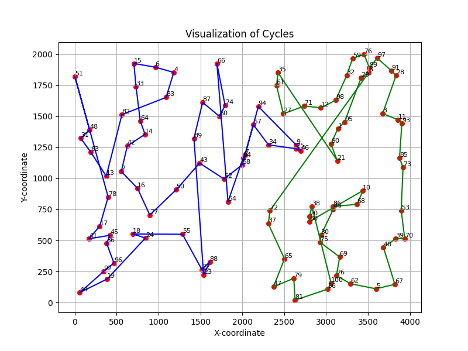 |
| greedy inner random | 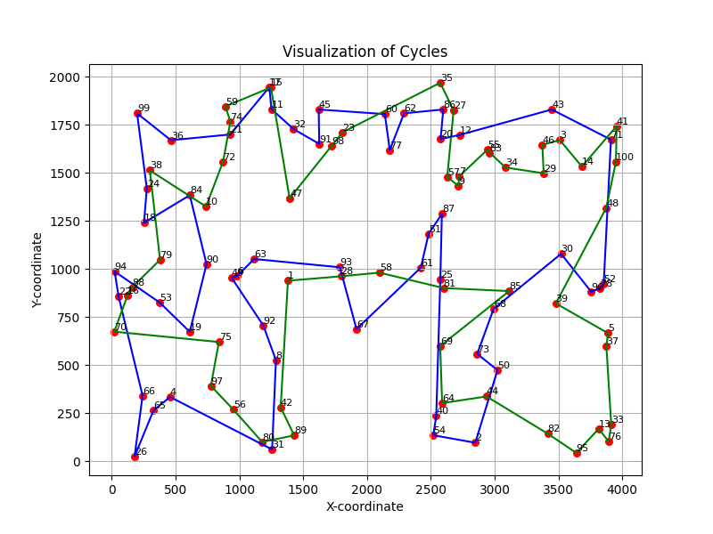 | 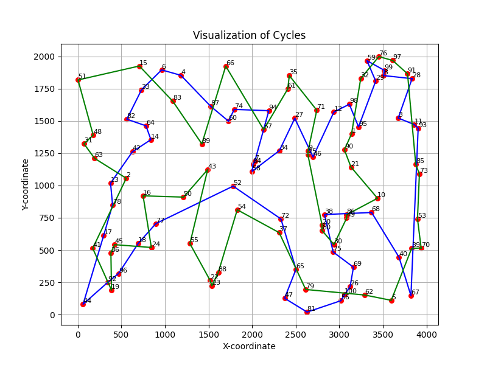 |
| greedy inner heuristic | 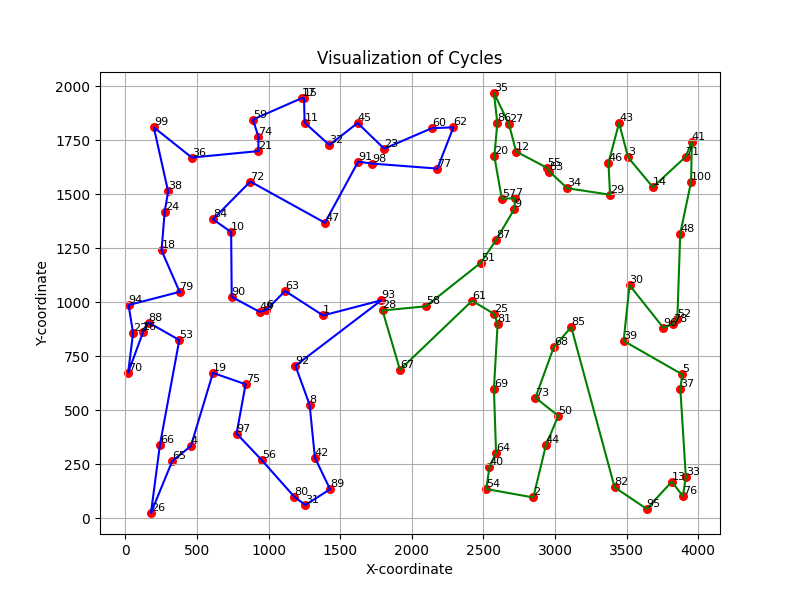 | 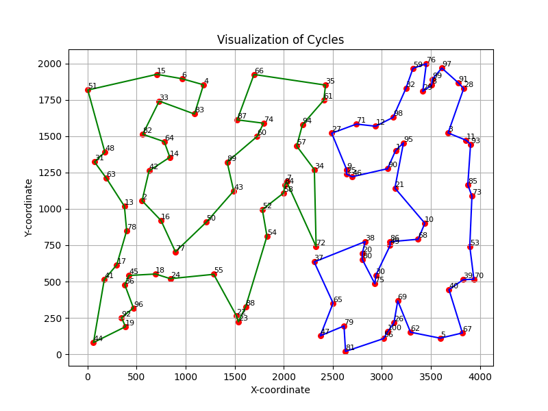 |
| greedy between random | 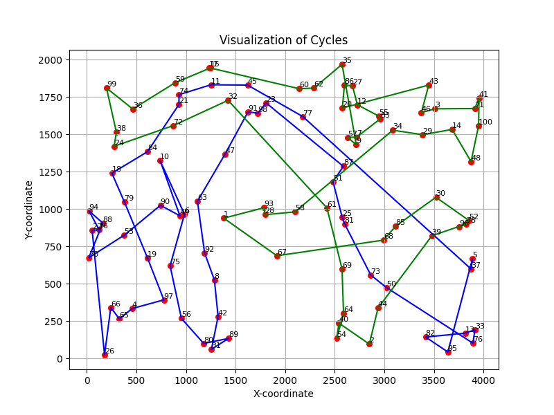 | 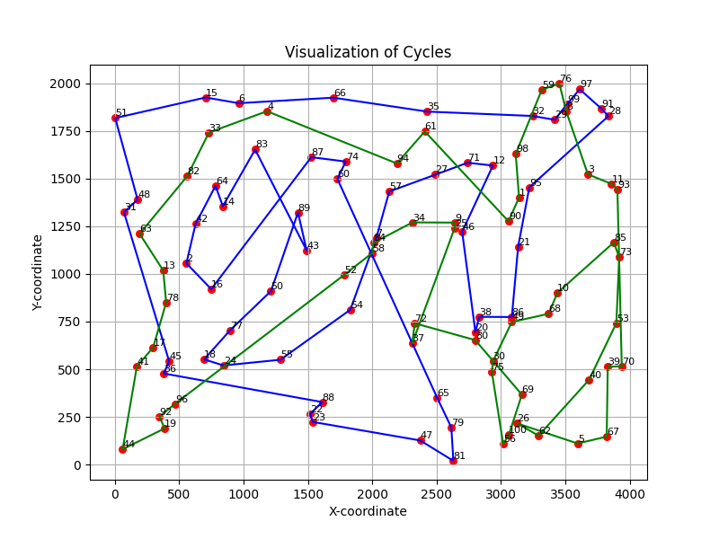 |
| greedy between heuristic | 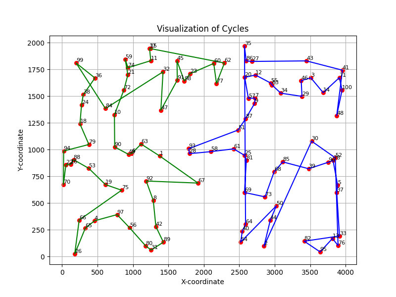 | 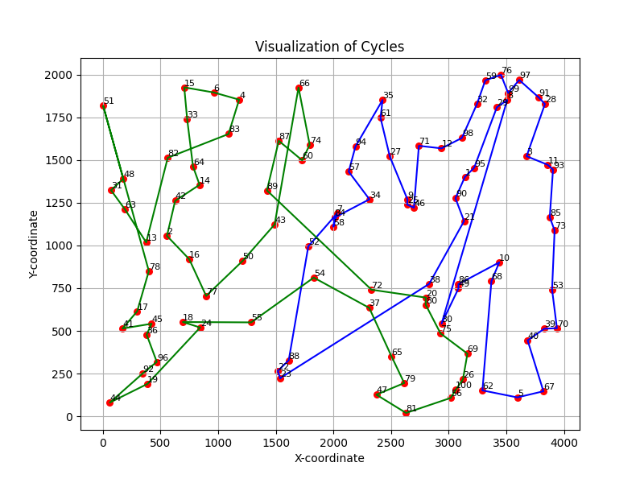 |
| random inner heuristic | 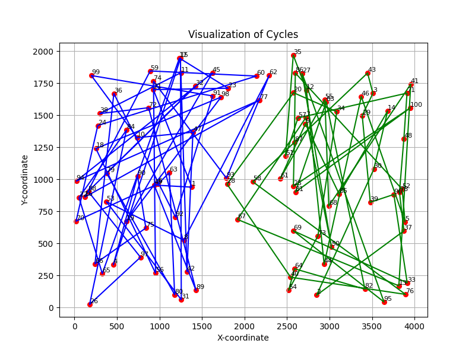 | 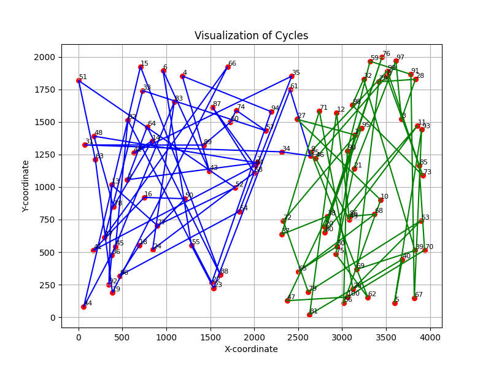 |


### Wnioski

- Algorytmy lokalnego przeszukiwania, zarówno w wersji stromej jak i zachłannej, wykazują różnice w skuteczności w zależności od wyboru początkowego rozwiązania oraz rodzaju sąsiedztwa.
- Wykorzystanie heurystyk w początkowych rozwiązaniach znacząco poprawia efektywność algorytmów, szczególnie widoczne jest to w przypadku metodfy stromej.
- Local search w wersji stromej osiąga zazwyczaj lepsze wyniki od metody zachłannej, co sugeruje, że bardziej dogłębne przeszukiwanie sąsiedztwa przynosi korzyści w przypadku tego konkretnego problemu.


### Kod Programu

Kod programu znajduje się pod [tym linkiem](https://github.com/majsterkovic/imo/blob/main/lab2/) w pliku cpp.
