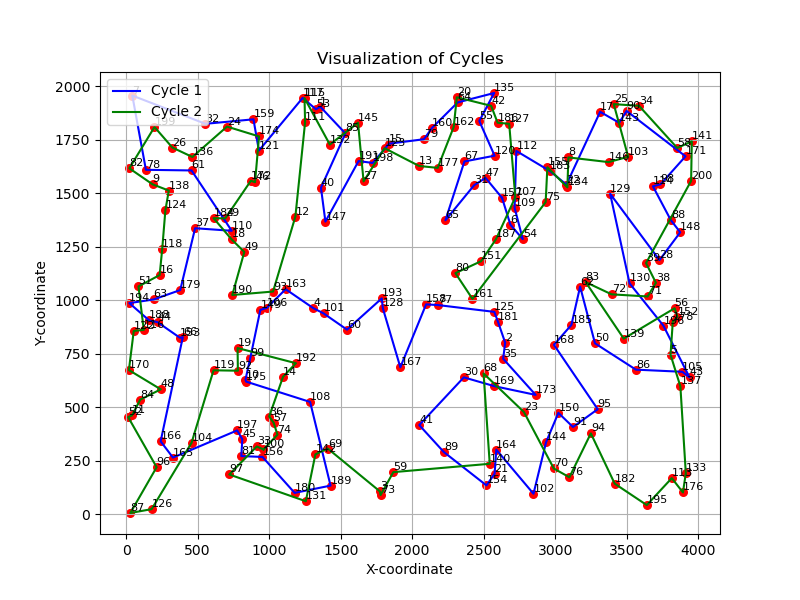
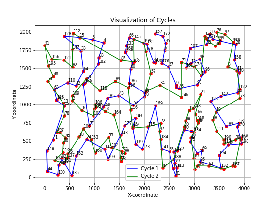
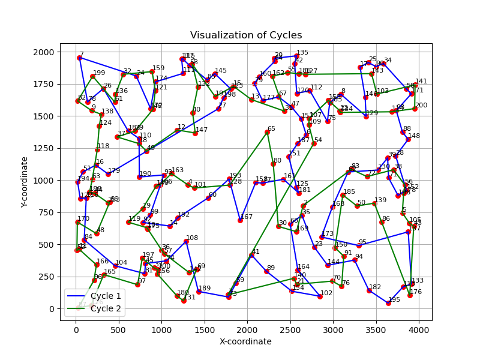
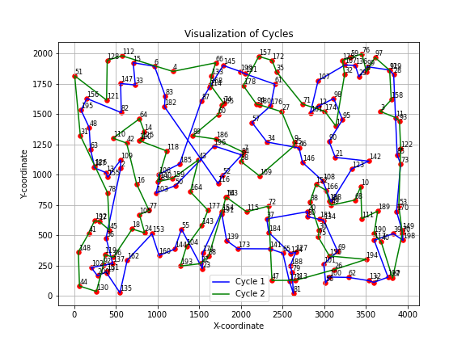
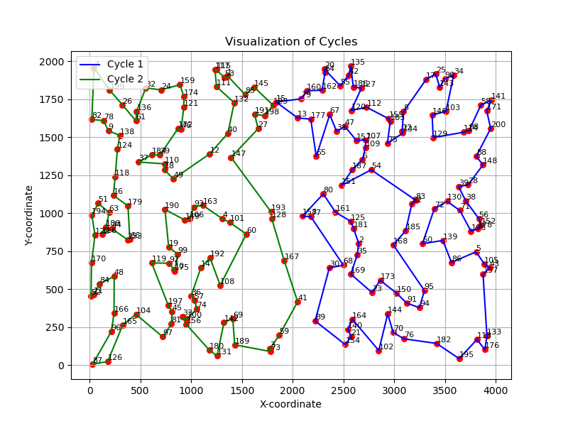
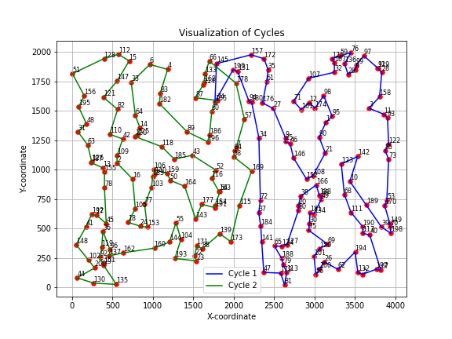

## Sprawozdanie z laboratorium nr 4
# Inteligentne Metody Optymalizacji

Autorzy: Jakub Gołąb, Mariusz Hybiak

### Wprowadzenie
Celem zadania było rozszerzenie implementacji lokalnego przeszukiwania stosując trzy metody:
- (MSLS) Multiple start local search
- (ILS1) Iterated local search - Iteracyjne przeszukiwanie lokalne z niewielką perturbacją
- (ILS2) Iterated local search - Iteracyjne przeszukiwanie lokalne z Large-scale neighborhood search, tj. większą perturbacją typu Destroy-Repair
### Algorytmy
#### MSLS
```pseudocode

function MSLS(distance_matrix, data, n_iter):
    best_cycle1 = NULL
    best_cycle2 = NULL
    best_total_length = INFINITY

    for n_iter:
      cycle1, cycle2 = random_cycle(data)
      cycle1, cycle2 = candidate_moves_algorithm(cycle1, cycle2, distance_matrix, data)
      length = calculate_cycles_length(cycle1, cycle2, distance_matrix)

      if length < best_length:
        best_cycle_1 = cycle1
        best_cycle_2 = cycle2
        best_length = length
    
    return best_cycle1, best_cycle2
```
#### ILS1
```pseudocode
function ILS1(distance_matrix, data, time_MSLS):
    best_cycle_1, best_cycle_2 = random_cycle(data)
    best_cycle_1, best_cycle_2 = candidate_moves_algorithm(best_cycle_1, best_cycle_2, distance_matrix, data)
    best_length = calculate_cycles_length(best_cycle_1, best_cycle_2, distance_matrix)

    while time_elapsed <= time_MSLS:
        cycle1, cycle2 = little_perturbation(best_cycle_1, best_cycle_2)
        cycle1, cycle2 = candidate_moves_algorithm(cycle1, cycle2, distance_matrix, data)
        length = calculate_cycles_length(cycle1, cycle2, distance_matrix)
        if length < best_length:
            best_length = length
            best_cycle_1 = cycle1
            best_cycle_2 = cycle2
    
    return best_cycle_1, best_cycle_2

function little_perturbation(cycle1, cycle2):
    foreach cycle in set_of[cycle1, cycle2]:
        cycle = swap_random_nodes(cycle1, cycle2, 0.2)

    return cycle1, cycle2
```

### ILS2
```
function ILS2(distance_matrix, data, time_MSLS):
    best_cycle_1, best_cycle_2 = random_cycle(data)
    best_cycle_1, best_cycle_2 = candidate_moves_algorithm(best_cycle_1, best_cycle_2, distance_matrix, data)
    best_length = calculate_cycles_length(best_cycle_1, best_cycle_2, distance_matrix)

    while time_elapsed <= time_MSLS:
        cycle1, cycle2 = severe_perturbation(best_cycle_1, best_cycle_2)
        cycle1, cycle2 = candidate_moves_algorithm(cycle1, cycle2, distance_matrix, data)
        length = calculate_cycles_length(cycle1, cycle2, distance_matrix)
        if length < best_length:
            best_length = length
            best_cycle_1 = cycle1
            best_cycle_2 = cycle2
    
    return best_cycle_1, best_cycle_2

function severe_perturbation(cycle1, cycle2, distance_matrix):
    original_size_cycle1 = length_of(cycle1)
    original_size_cycle2 = length_of(cycle2)

    random1 = get_random_nodes_of(cycle1)
    random2 = get_random_nodes_of(cycle2)

    cycle1 = swap_random_nodes_of(cycle1, random1)
    cycle2 = swap_random_nodes_of(cycle2, random2)

    # Repair
    cities = random1 + random2

    while length_of(cycle1) < original_size_cycle1:
        current_city = cycle1.last_element()
        nearest_city = find_closest_city(current_city, distance_matrix)
        cycle1.append(nearest_city)
        cities.remove(nearest_city)

    while length_of(cycle2) < original_size_cycle2:
        current_city = cycle2.last_element()
        nearest_city = find_closest_city(current_city, distance_matrix)
        cycle2.append(nearest_city)
        cities.remove(nearest_city)
    
    return cycle1, cycle2
```
### Wyniki eksperymentu obliczeniowego
W tabeli przedstawiono sumy długości cykli dla każdej z metod dla obu instancji problemu.

<div>
<table border="1" class="dataframe">
  <thead>
    <tr>
      <th></th>
      <th></th>
      <th colspan="3" halign="left">Długość cyklu</th>
    </tr>
    <tr>
      <th></th>
      <th></th>
      <th>min</th>
      <th>mean</th>
      <th>max</th>
    </tr>
    <tr>
      <th>Instancja</th>
      <th>Algorytm</th>
      <th></th>
      <th></th>
      <th></th>
    </tr>
  </thead>
  <tbody>
    <tr>
      <th rowspan="3" valign="top">kroA200.tsp</th>
      <th>MSLS</th>
      <td>43440.074</td>
      <td>44181.734</td>
      <td>44552.210</td>
    </tr>
    <tr>
      <th>ISL1</th>
      <td>47933.072</td>
      <td>48803.432</td>
      <td>50472.015</td>
    </tr>
    <tr>
      <th>ISL2</th>
      <td>31617.228</td>
      <td>34258.148</td>
      <td>39236.820</td>
    </tr>
    <tr>
      <th rowspan="3" valign="top">kroB200.tsp</th>
      <th>MSLS</th>
      <td>43922.327</td>
      <td>43964.201</td>
      <td>44285.143</td>
    </tr>
    <tr>
      <th>ISL1</th>
      <td>45593.615</td>
      <td>46553.961</td>
      <td>47873.625</td>
    </tr>
    <tr>
      <th>ISL2</th>
      <td>32118.157</td>
      <td>36719.520</td>
      <td>39958.189</td>
    </tr>
  </tbody>
</table>
</div>

### Czas działania algorytmu
W tabeli przedstawiono średni czas działania algorytmu.

<div>
<table border="1" class="dataframe">
  <thead>
    <tr>
      <th></th>
      <th></th>
      <th colspan="3" halign="left">Czas wykonania</th>
    </tr>
    <tr>
      <th></th>
      <th></th>
      <th>min</th>
      <th>mean</th>
      <th>max</th>
    </tr>
    <tr>
      <th>Instancja</th>
      <th>Algorytm</th>
      <th></th>
      <th></th>
      <th></th>
    </tr>
  </thead>
  <tbody>
    <tr>
      <th rowspan="3" valign="top">kroA200.tsp</th>
      <th>MSLS</th>
      <td>593.978</td>
      <td>595.418</td>
      <td>596.176</td>
    </tr>
    <tr>
      <th>ISL1</th>
      <td>600.318</td>
      <td>601.727</td>
      <td>602.610</td>
    </tr>
    <tr>
      <th>ISL2</th>
      <td>600.034</td>
      <td>602.170</td>
      <td>603.832</td>
    </tr>
    <tr>
      <th rowspan="3" valign="top">kroB200.tsp</th>
      <th>MSLS</th>
      <td>403.026</td>
      <td>407.896</td>
      <td>414.910</td>
    </tr>
    <tr>
      <th>ISL1</th>
      <td>407.059</td>
      <td>412.071</td>
      <td>419.148</td>
    </tr>
    <tr>
      <th>ISL2</th>
      <td>408.103</td>
      <td>412.903</td>
      <td>420.416</td>
    </tr>
  </tbody>
</table>
</div>


### Wizualizacje najlepszych rozwiązań
| Metoda |  KroA200 |   KroB200 |
|--------|----------|-----------|
| MSLS |  |  |
| ISL1 (greedy cycle) |  |  |
| ISL2 |  |  |


### Wnioski
- Najwaniejszą obserwacją jest fakt, e algorytm ISL2, którego zadaniem było znaczące zepsucie biezącego rozwiązania (w naszym przypadku 30% całego cyklu) oraz próba jego naprawy przy uzyciu heurystyki daje najlepsze rezultaty. Widać to po sumarycznej długości najlepszych cykli, oraz to, ze na płaszczyźnie dwuwymiarowej obydwa cykle są wyraźnie rozdzielone i praktycznie w ogóle na siebie nie nachodzą.

### Kod programu

Kod programu znajduje się pod [tym linkiem](https://github.com/majsterkovic/imo/blob/main/lab4/).