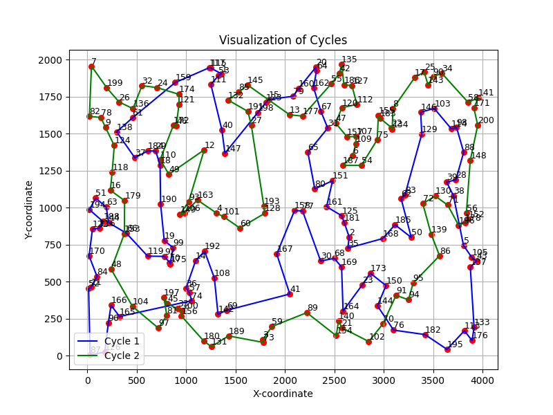
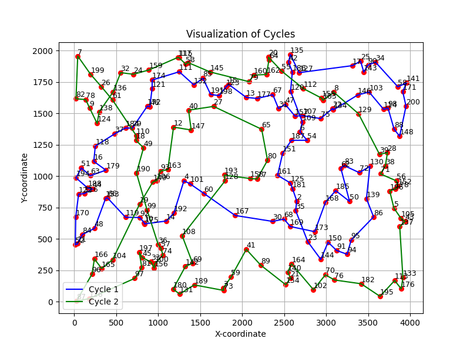
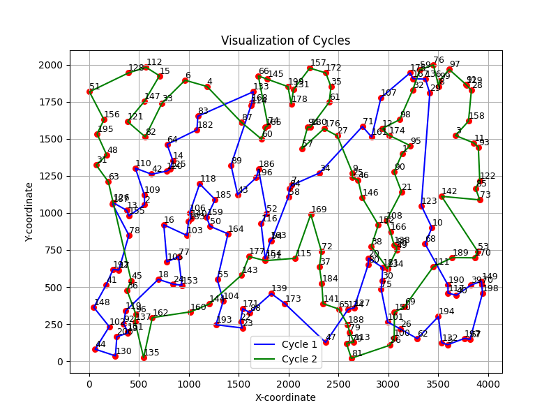
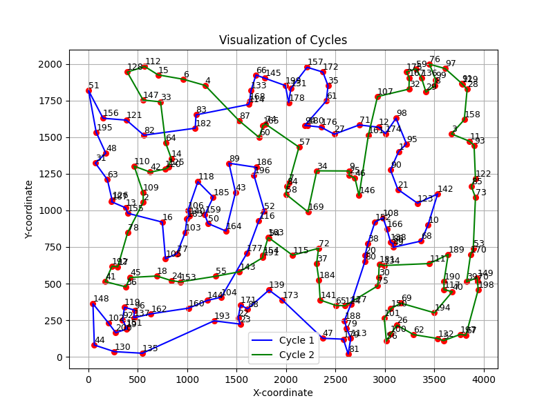
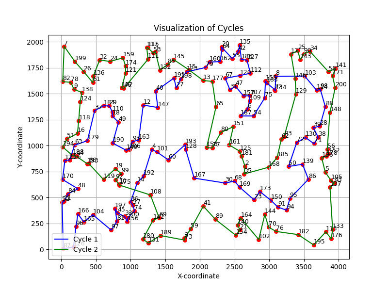
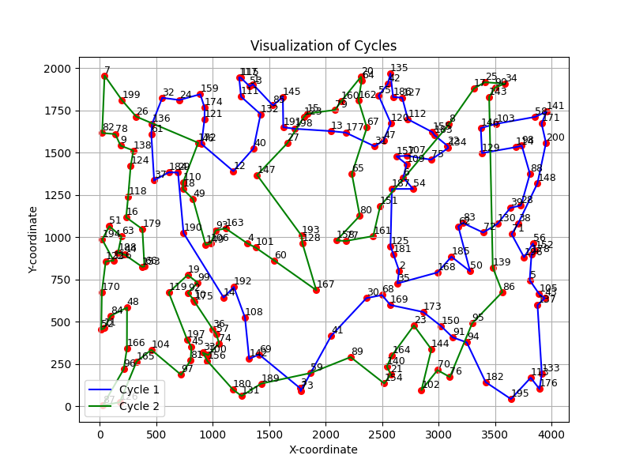
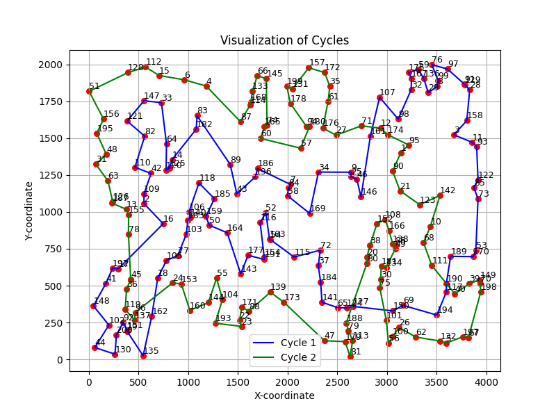
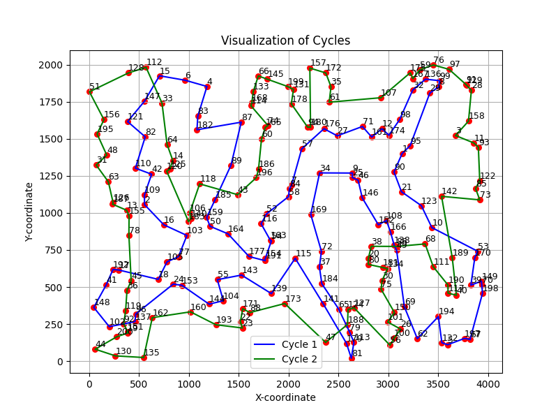

## Sprawozdanie z laboratorium nr 4
# Inteligentne Metody Optymalizacji

Autorzy: Jakub Gołąb, Mariusz Hybiak

### Wprowadzenie
Celem zadania było rozszerzenie implementacji lokalnego przeszukiwania stosując trzy metody:
- (MSLS) Multiple start local search
- (ILS1) Iterated local search - Iteracyjne przeszukiwanie lokalne z niewielką perturbacją
- (ILS2) Iterated local search - Iteracyjne przeszukiwanie lokalne z Large-scale neighborhood search, tj. większą perturbacją typu Destroy-Repair
### Algorytmy
#### MSLS
```pseudocode

function MSLS(distance_matrix, data, n_iter):
    best_cycle1 = NULL
    best_cycle2 = NULL
    best_total_length = INFINITY

    for n_iter:
      cycle1, cycle2 = random_cycle(data)
      cycle1, cycle2 = local_search(cycle1, cycle2, distance_matrix, data)
      length = calculate_cycles_length(cycle1, cycle2, distance_matrix)

      if length < best_length:
        best_cycle_1 = cycle1
        best_cycle_2 = cycle2
        best_length = length
    
    return best_cycle1, best_cycle2
```
#### ILS1
```pseudocode
function ILS1(distance_matrix, data, time_MSLS):
    best_cycle_1, best_cycle_2 = random_cycle(data)
    best_cycle_1, best_cycle_2 = local_search(best_cycle_1, best_cycle_2, distance_matrix, data)
    best_length = calculate_cycles_length(best_cycle_1, best_cycle_2, distance_matrix)

    while time_elapsed <= time_MSLS:
        cycle1, cycle2 = little_perturbation(best_cycle_1, best_cycle_2)
        cycle1, cycle2 = local_search(cycle1, cycle2, distance_matrix, data)
        length = calculate_cycles_length(cycle1, cycle2, distance_matrix)
        if length < best_length:
            best_length = length
            best_cycle_1 = cycle1
            best_cycle_2 = cycle2
    
    return best_cycle_1, best_cycle_2

function little_perturbation(cycle1, cycle2):
    foreach cycle in set_of[cycle1, cycle2]:
        cycle = swap_random_nodes(cycle1, cycle2, 0.2)

    return cycle1, cycle2
```

### ILS2
```
function ILS2(distance_matrix, data, time_MSLS):
    best_cycle_1, best_cycle_2 = random_cycle(data)
    best_cycle_1, best_cycle_2 = local_search(best_cycle_1, best_cycle_2, distance_matrix, data)
    best_length = calculate_cycles_length(best_cycle_1, best_cycle_2, distance_matrix)

    while time_elapsed <= time_MSLS:
        cycle1, cycle2 = severe_perturbation(best_cycle_1, best_cycle_2)
        cycle1, cycle2 = local_search(cycle1, cycle2, distance_matrix, data)
        length = calculate_cycles_length(cycle1, cycle2, distance_matrix)
        if length < best_length:
            best_length = length
            best_cycle_1 = cycle1
            best_cycle_2 = cycle2
    
    return best_cycle_1, best_cycle_2

function severe_perturbation(cycle1, cycle2, distance_matrix):
    original_size_cycle1 = length_of(cycle1)
    original_size_cycle2 = length_of(cycle2)

    random1 = get_random_nodes_of(cycle1)
    random2 = get_random_nodes_of(cycle2)

    cycle1 = swap_random_nodes_of(cycle1, random1)
    cycle2 = swap_random_nodes_of(cycle2, random2)

    # Repair
    cities = random1 + random2
    while(len(cities) > 0)
      if length_of(cycle1) < original_size_cycle1:
          greedy_cycle(cycle1, cities, distance_matrix)

      if length_of(cycle2) < original_size_cycle2:
          greedy_cycle(cycle2, cities, distance_matrix)
    
    return cycle1, cycle2
```
### Wyniki eksperymentu obliczeniowego
W tabeli przedstawiono sumy długości cykli dla każdej z metod dla obu instancji problemu oraz czasy wykonania.

<div>
<style scoped>
    .dataframe tbody tr th:only-of-type {
        vertical-align: middle;
    }

    .dataframe tbody tr th {
        vertical-align: top;
    }

    .dataframe thead th {
        text-align: right;
    }
</style>
<table border="1" class="dataframe">
  <thead>
    <tr style="text-align: right;">
      <th></th>
      <th>Instance</th>
      <th>Method</th>
      <th>min time</th>
      <th>mean time</th>
      <th>max time</th>
      <th>min length</th>
      <th>mean length</th>
      <th>max length</th>
    </tr>
  </thead>
  <tbody>
    <tr>
      <th>0</th>
      <td>data/kroA200.tsp</td>
      <td>ILS1</td>
      <td>398.439000</td>
      <td>401.822894</td>
      <td>407.151261</td>
      <td>35132.241805</td>
      <td>36467.784606</td>
      <td>37713.010272</td>
    </tr>
    <tr>
      <th>1</th>
      <td>data/kroA200.tsp</td>
      <td>ILS2</td>
      <td>390.630000</td>
      <td>393.861476</td>
      <td>398.987001</td>
      <td>34584.205322</td>
      <td>36029.483108</td>
      <td>39188.511584</td>
    </tr>
    <tr>
      <th>2</th>
      <td>data/kroA200.tsp</td>
      <td>ILS2a</td>
      <td>401.236000</td>
      <td>401.775724</td>
      <td>402.434999</td>
      <td>31287.750689</td>
      <td>32032.848833</td>
      <td>33039.638350</td>
    </tr>
    <tr>
      <th>3</th>
      <td>data/kroA200.tsp</td>
      <td>MSLS</td>
      <td>390.594031</td>
      <td>393.835123</td>
      <td>398.972001</td>
      <td>35405.032448</td>
      <td>36231.844409</td>
      <td>36537.735383</td>
    </tr>
    <tr>
      <th>4</th>
      <td>data/kroB200.tsp</td>
      <td>ILS1</td>
      <td>396.210132</td>
      <td>421.961807</td>
      <td>477.018051</td>
      <td>35305.112331</td>
      <td>36128.036000</td>
      <td>36766.275195</td>
    </tr>
    <tr>
      <th>5</th>
      <td>data/kroB200.tsp</td>
      <td>ILS2</td>
      <td>388.648000</td>
      <td>413.776645</td>
      <td>467.546440</td>
      <td>33276.893733</td>
      <td>36248.175578</td>
      <td>39280.127460</td>
    </tr>
    <tr>
      <th>6</th>
      <td>data/kroB200.tsp</td>
      <td>ILS2a</td>
      <td>401.115705</td>
      <td>401.606556</td>
      <td>402.008951</td>
      <td>32143.933715</td>
      <td>32824.243708</td>
      <td>34079.993762</td>
    </tr>
    <tr>
      <th>7</th>
      <td>data/kroB200.tsp</td>
      <td>MSLS</td>
      <td>388.607016</td>
      <td>413.750936</td>
      <td>467.529489</td>
      <td>34859.235914</td>
      <td>36378.274770</td>
      <td>37180.009204</td>
    </tr>
  </tbody>
</table>
</div>

### Wizualizacje najlepszych rozwiązań
|                       | ILS1         | ILS2            |
|-----------------------|-------------------------------------------------|-------------------------------------------------|
| **datakroA200.tsp** |  |  |
| **datakroB200.tsp**   |  |  | 

|                       | ILS2a        | MSLS      |
|-----------------------|-------------------------------------------------|-------------------------------------------------|
| **datakroA200.tsp** |   |               |
| **datakroB200.tsp**  |      |               |


### Wnioski
- Najlepsze wyniki uzyskano dla metody ILS2a, która jest wariantem ILS2 z przeszukiwaniem lokalnym.
- Wyniki dla metod są porównywalne z metodami z poprzednich laboratoriów.
- Rozmiar perturbacji nie pozwala na uzyskanie odseparowania cykli.

### Kod programu

Kod programu znajduje się pod [tym linkiem](https://github.com/majsterkovic/imo/blob/main/lab4/).