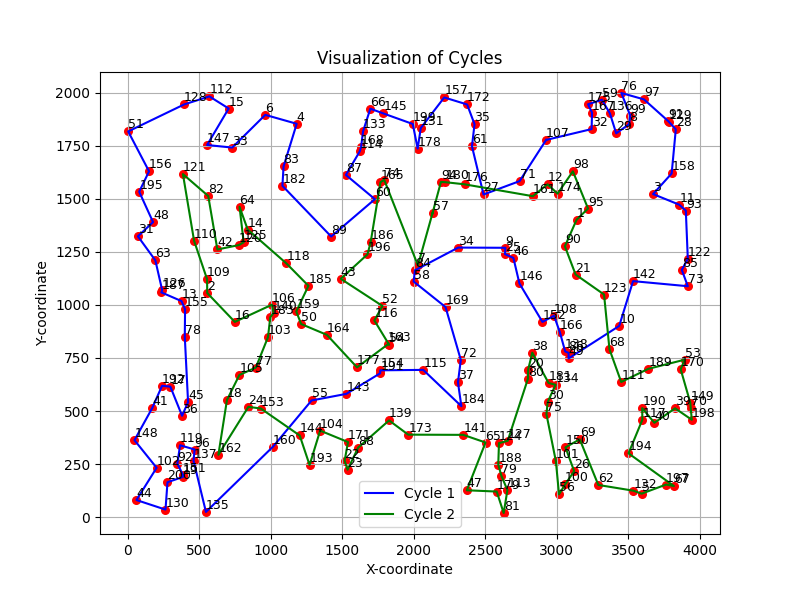

## Sprawozdanie z laboratorium nr 5
# Inteligentne Metody Optymalizacji

Autorzy: Jakub Gołąb, Mariusz Hybiak

### Wprowadzenie
Celem zadania była implementacja hybrydowego algorytmu ewolucyjnego (HAE) i porównanie go z metodami MSLS i ILSx zaimplementowanymi w poprzednim zadaniu.

Dla każdego algorytmu zostało wykonane 10 iteracji na instancjach testowych kroA200.tsp i kroB200.tsp.

### Parametry:
#### HAE
- populacja elitarna: 20
- liczba generacji: 100
#### MSLS
- liczba iteracji 200
#### ILS1
- czas trwania: taki jak MSLS
#### ILS2
- czas trwania: taki jak MSLS
- wielkość perturbacji: 20%

### Algorytmy
``` pseudocode
function hybrid_evolutionary_algorithm:
    Inicjalizuj populację za pomocą funkcji gen_initial_population
    Dla każdej generacji w num_generations:
        Wybierz losowo dwóch rodziców (x, y) z populacji
        //Przeprowadź rekombinację rodziców, aby uzyskać potomstwo
        potomstwo = recombine(x, y)
        Jeśli tryb lokalny jest włączony:
            Zastosuj lokalne przeszukiwanie do potomstwa
            potomstwo = local_search(potomstwo)
        //Znajdź najgorszego osobnika w populacji
        worst = argmax(population)

        //Jeśli potomstwo jest lepsze niż najgorszy osobnik i jest wystarczająco różnorodne
        if offspring.length < worst.length and is_diverse(offspring) then
            Zastąp najgorszego osobnika w populacji potomstwem

    //Znajdź najlepszego osobnika w populacji
    best = argmin(population)
    //Zwróć najlepszego osobnika
    return best
```

``` pseudocode
function is_diverse:
    //Oblicz długość cykli przekazanego osobnika
    individual_length = calculate_length(individual)
    Dla każdego osobnika w populacji:
        Oblicz długość cykli tego osobnika
        //Jeśli różnica długości cykli jest mniejsza niż próg
        if abs(individual_length - osobnik.length) < threshold * individual_length:
            Zwróć fałsz
    Zwróć prawdę
```

``` pseudocode
function recombine:
    Zidentyfikuj krawędzie występujące w drugim rodzicu
    //Utwórz kopie cykli pierwszego rodzica
    cycle1 = deepcopy(parent1[0])
    cycle2 = deepcopy(parent1[1])

    Oznacz krawędzie występujące zarówno w cyklach pierwszego rodzica, jak i w krawędziach drugiego rodzica
    for index in cycle1.length:
        if (cycle1[index], cycle1[(index+1) % cycle1.length]) in edges_in_parent_2:
            cycle1_marked[index] = True
            cycle1_marked[(index+1) % cycle1.length] = True
    
    for index in cycle2.length:
        if (cycle2[index], cycle2[(index+1) % cycle2.length]) in edges_in_parent_2:
            cycle2_marked[index] = True
            cycle2_marked[(index+1) % cycle2.length] = True

    Zidentyfikuj wolne wierzchołki, które nie są oznaczone w cyklach

    Usuń nieoznaczone wierzchołki z cykli

    Dopóki istnieją wolne wierzchołki:
        Jeśli cykl1 jest krótszy niż 100 wierzchołków:
            Znajdź najlepszy wierzchołek do dodania do cyklu1
            Dodaj wierzchołek do cyklu1 i usuń go z wolnych wierzchołków

        Jeśli cykl2 jest krótszy niż 100 wierzchołków:
            Znajdź najlepszy wierzchołek do dodania do cyklu2
            Dodaj wierzchołek do cyklu2 i usuń go z wolnych wierzchołków

    //Zwróć zrekombinowane cykle
    return cycle1, cycle2
```

``` pseudocode
function gen_initial_population:
    Inicjalizuj pustą populację
    for _ in 0...size:
        //Wygeneruj losowe cykle z danych
        random = get_random_cycles(data)
        //Zastosuj lokalne przeszukiwanie do losowych cykli
        ls = local_search(random)
        
        Dodaj przeszukane lokalnie cykle do populacji
    Zwróć populację
```


### Wyniki eksperymentu obliczeniowego
W tabeli przedstawiono sumy długości cykli dla każdej z metod dla obu instancji problemu.

### Połączona tabela
|   | Instance         | Method   | min time (s) | mean time (s)| max time (s)| min length | mean length | max length |
|---|------------------|--------  |----------|-----------|----------|------------|-------------|------------|
| 0 | kroA200.tsp      | HAE      | 198.93   | 200.62    | 203.29   | 33100.94   | 36204.22    | 36990.61   |
| 1 | kroA200.tsp      | HAE+local| 265.75   | 271.73    | 277.93   | 32931.29   | 34792.19    | 36657.45   |
| 2 | kroB200.tsp      | HAE      | 197.15   | 200.63    | 205.55   | 33980.91   | 36443.62    | 37876.89   |
| 3 | kroB200.tsp      | HAE_local| 266.46   | 271.32    | 278.92   | 32808.76   | 34952.39    | 36814.39   |
| 4 | kroA200.tsp      | ILS1     | 398.44   | 401.82    | 407.15   | 35132.24   | 36467.78    | 37713.01   |
| 5 | kroA200.tsp      | ILS2     | 390.63   | 393.86    | 398.99   | 34584.21   | 36029.48    | 39188.51   |
| 6 | kroA200.tsp      | ILS2a    | 401.24   | 401.78    | 402.43   | 31287.75   | 32032.85    | 33039.64   |
| 7 | kroA200.tsp      | MSLS     | 390.59   | 393.84    | 398.97   | 35405.03   | 36231.84    | 36537.74   |
| 8 | kroB200.tsp      | ILS1     | 396.21   | 421.96    | 477.02   | 35305.11   | 36128.04    | 36766.28   |
| 9 | kroB200.tsp      | ILS2     | 388.65   | 413.78    | 467.55   | 33276.89   | 36248.18    | 39280.13   |
| 10| kroB200.tsp      | ILS2a    | 401.12   | 401.61    | 402.01   | 32143.93   | 32824.24    | 34079.99   |
| 11| kroB200.tsp      | MSLS     | 388.61   | 413.75    | 467.53   | 34859.24   | 36378.27    | 37180.01   |
| 12| kroA200.tsp	    | Greedy LS |0.3899    | 0.4026    | 0.416    | 35901.48   | 38420.26    | 39846.51   |
| 13|	kroB200.tsp	    | Greedy LS |0.3890	   | 0.3955    | 0.401	  | 34833.70   | 38568.98	   | 41607.48   |


### Wizualizacje najlepszych rozwiązań

| Instancja / algorytm         | Podgląd                                  |
|------------------------------|      ------------------------            |
| kroA200 / HAE                |   |
| kroA200 / HAE + local        |    |
| kroB200 / HAE                |   |
| kroB200 / HAE + local        |    |
| kroA200 / Greedy             |   |
| kroA200 / Greedy             |   |

### Wykresy

| Instancja \ Algorytm | ILS1             | ILS2            | ILS2a                         | MSLS                       |
|------------------|-------------------|--------------------------|------------------------|------------------------------|
| datakroA200.tsp      | |  |  |  |
| datakroB200.tsp      |  | |  |  |


### Wnioski
-

### Kod programu

Kod programu znajduje się pod [tym linkiem](https://github.com/majsterkovic/imo/blob/main/lab5/).