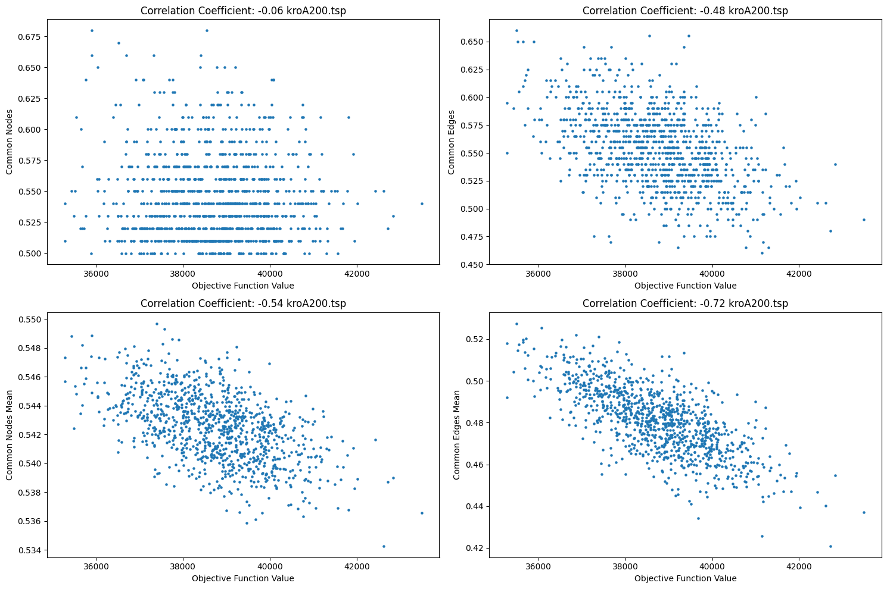
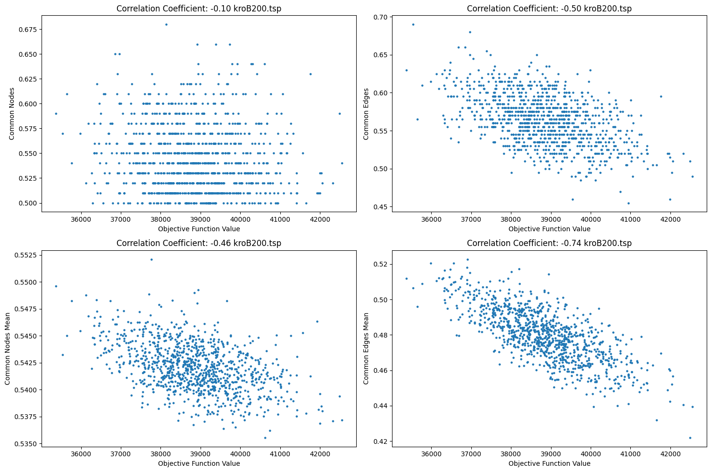

## Sprawozdanie z laboratorium nr 6
# Inteligentne Metody Optymalizacji

Autorzy: Jakub Gołąb, Mariusz Hybiak

### Wprowadzenie

Celem zadania było zbadanie globalnej wypukłości funkcji celu poprzez analizę lokalnych minimów znalezionych za pomocą lokalnego przeszukiwania.

Stosujemy dwie miary podobieństwa: 
* Liczba wspólnych wierzchołków znajdujących się w cyklu liczona względem bardziej podobnego  cyklu w drugim rozwiązaniu. Następnie sumujemy te liczby dla obu cykli.
* Liczba wspólnych krawędzi.  

### Pseudokod

```pseudocode
def calculate_common_edges(c1a, c1b, c2a, c2b):
    edges_in_c1 = set(cycle_to_edges(c1a)).union(cycle_to_edges(c1b))
    edges_in_c2 = set(cycle_to_edges(c2a)).union(cycle_to_edges(c2b))

    common_edges = edges_in_c1.intersection(edges_in_c2)
    percentage = len(common_edges) / len(edges_in_c1)
    return percentage

def calculate_common_nodes(c1a, c1b, c2a, c2b):
    c1a_set, c1b_set = set(c1a), set(c1b)
    c2a_set, c2b_set = set(c2a), set(c2b)

    common_nodes_1 = len(c1a_set.intersection(c2a_set)) + len(c1b_set.intersection(c2b_set))
    common_nodes_2 = len(c1a_set.intersection(c2b_set)) + len(c1b_set.intersection(c2a_set))

    max_nodes = max(common_nodes_1, common_nodes_2)
    percentage = max_nodes / (len(c1a) + len(c1b))
    return percentage

def calculate_mean_common_edges(c1a, c1b, cycles):
    common_edges = (calculate_common_edges(c1a, c1b, c2a, c2b) for c2a, c2b in cycles)
    return np.mean(list(common_edges))

def calculate_mean_common_nodes(c1a, c1b, cycles):
    common_nodes = (calculate_common_nodes(c1a, c1b, c2a, c2b) for c2a, c2b in cycles)
    return np.mean(list(common_nodes))
```

### Wyniki

* Na osi X naniesiono wartości funkcji celu.
* Na osi Y na dwóch górnych wykresach naniesiono wartości podobieństwa rozwiązań do najlepszego rozwiązania wygenerowanego metodą ILS2a.
* Na osi Y na dwóch dolnych wykresach naniesiono średnie podobieństwo dla wszystkich pozostałych optimów lokalnych z tego zbioru.


#### Instancja kroA200.tsp


</br></br></br></br></br></br></br></br></br></br></br></br></br></br></br></br></br></br></br></br></br></br></br></br></br></br></br></br></br></br></br></br></br></br></br></br></br></br></br></br></br></br></br></br>


#### Instancja kroB200.tsp


### Najlepsze cykle z metody ILS2a

| kroA200 | kroB200 |
|-----------|------|
|  |  |


## Wnioski

* Analizując wykres średniego podobieństwa w zależności od funkcji celu, można zauważyć, że wraz ze wzrostem wartości funkcji celu, średnie podobieństwo maleje. Oznacza to, że wraz z pogorszeniem wyniku, rośnie różnorodność rozwiązań. W przeciwnym przypadku, gdy wartość funkcji celu jest niska, średnie podobieństwo jest wysokie, co oznacza, że rozwiązania są bardziej zbliżone do siebie. Dotyczy to zarówno wierzchołków jak i krawędzi.

* Ta korelacja jest zdecydowanie mniej zauważalna w przypadku do porównywania z najlepszym rozwiązaniem.