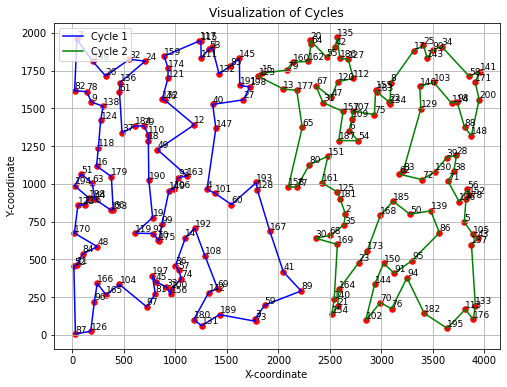
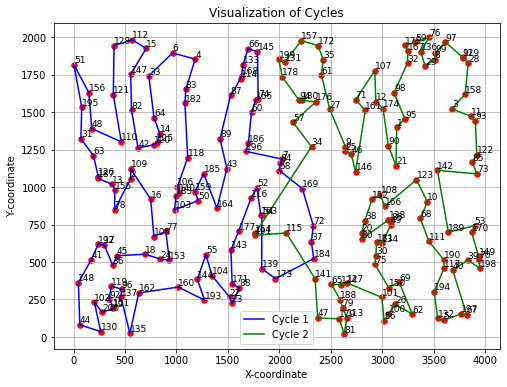

## Sprawozdanie z laboratorium nr 7
# Inteligentne Metody Optymalizacji

Autorzy: Jakub Gołąb, Mariusz Hybiak

Zadanie 7. Własna metoda

### Wprowadzenie

Celem zadania była próba poprawienia wcześniej zaimplementowanych algorytmów poprzez zastosowanie nowej metody.

Dla każdej instancji problemu zostały przeprowadzone testy dla 100 uruchomień algorytmu.
Do czasu działania nie jest wliczany czas generacji rozwiązań startowych, ponieważ jest on jednorazowy - rozwiązania startowe można wygenerować raz i używać wielokrotnie.

### Słowny opis metody

Jest to autorska metoda zainspirowana poprzednimi laboratoriami. Rozwiązania startowe nie są tutaj losowe. Początkowo jest generowana populacja 1000 rozwiązań. Dla każdej pary z nich sprawdzane są wspólne krawędzie. Następnie te wspólne krawędzie są zliczane i sortowane. 5% najczęściej występujących krawędzi służy do budowy rozwiązań startowych. Dalej rozwiązania te są rozbudowane poprzez dodawanie wierzchołków metodą greedy. Na tak powstałych pełnych cyklach uruchamiany jest algorytm ILS2 o zmiennym rozmiarze perturbacji. Jeśli perturbacja nie poprawia wyniku, to jest ona zwiększana. Jeśli w ciągu 10 iteracji nie udało się poprawić wyniku, to algorytm uruchamia lokalne przeszukiwanie. Ma to na celu optymalizację czasową działania algorytmu.

### Pseudokod

```pseudocode
wygeneruj 1000 rozwiązań startowych metodą LS greedy

oblicz wspólne krawędzie dla każdej pary rozwiązań

zliczaj wspólne krawędzie

wybierz 5% najczęściej występujących krawędzi

utwórz początek cyklu pierwszego z połowy krawędzi

utwórz początek cyklu drugiego z drugiej połowy krawędzi

dodaj wierzchołki metodą greedy uzupełniając cykl pierwszy

dodaj wierzchołki metodą greedy uzupełniając cykl drugi

zapamiętaj rozwiązanie startowe

dopóki nie minie czas
    uruchom ILS2 z perturbacją o zmiennym rozmiarze
    jeśli perturbacja nie poprawia wyniku
        zwiększ perturbację o 0.05
    jeśli w ciągu 10 iteracji nie udało się poprawić wyniku
        uruchom lokalne przeszukiwanie steepest
        zmniejsz perturbację o 0.05
    jeśli wynik jest lepszy od najlepszego
        zapamiętaj wynik
```

### Wyniki

<div>
<style scoped>
    .dataframe tbody tr th:only-of-type {
        vertical-align: middle;
    }

    .dataframe tbody tr th {
        vertical-align: top;
    }

    .dataframe thead th {
        text-align: right;
    }
</style>
<table border="1" class="dataframe">
  <thead>
    <tr style="text-align: right;">
      <th>filename</th>
      <th>min_time</th>
      <th>mean_time</th>
      <th>max_time</th>
      <th>min_length</th>
      <th>mean_length</th>
      <th>max_length</th>
    </tr>
  </thead>
  <tbody>
    <tr>
      <td>kroA200.tsp</td>
      <td>25.000386</td>
      <td>25.040874</td>
      <td>26.042522</td>
      <td>31262.513284</td>
      <td>31980.859761</td>
      <td>33214.320204</td>
    </tr>
        <tr>
      <td>kroB200.tsp</td>
      <td>25.0</td>
      <td>25.23375</td>
      <td>27.042993</td>
      <td>32617.154133</td>
      <td>33291.298487</td>
      <td>33402.594883</td>
    </tr>
  </tbody>
</table>
</div>


### Najlepsze cykle z metody

| kroA200 | kroB200 |
|-----------|------|
|  |  |


## Wnioski

* Metoda wymaga dużo czasu na generację rozwiązań startowych, ale jest to jednorazowe. Opierając się na tych danych można wielokrotnie uruchamiać algorytm w porzukiwaniu optymalnego rozwiązania.

* W niższym czasie udało się uzyskać wyniki porównywalne, a nawet lepsze (zwłaszcza dla instancji A), w porównaniu z innymi algorytmami.

* Algorytm zdaje się być stabilny w obrębie różnych instancji problemu.

* Możnaby spróbować zoptymalizować algorytm zmniejszając dopuszczalny czas działania. 

### Kod programu

Kod programu znajduje się pod [tym linkiem](https://github.com/majsterkovic/imo/blob/main/lab7/).